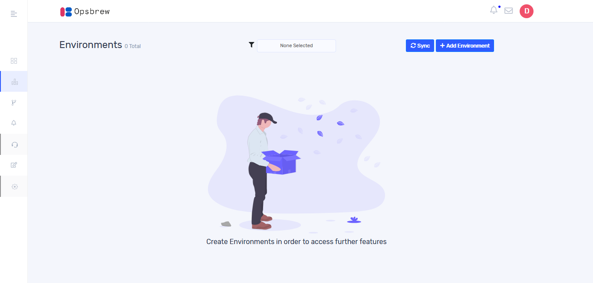
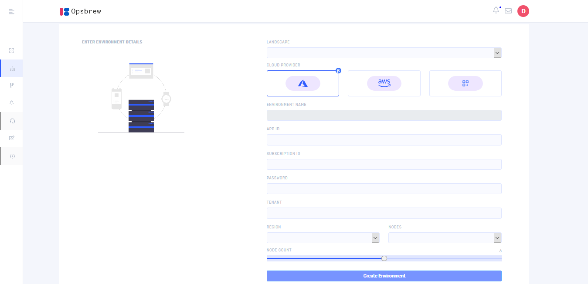
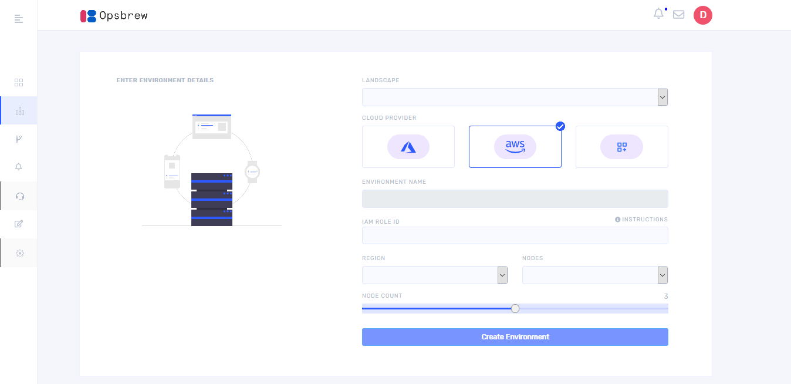
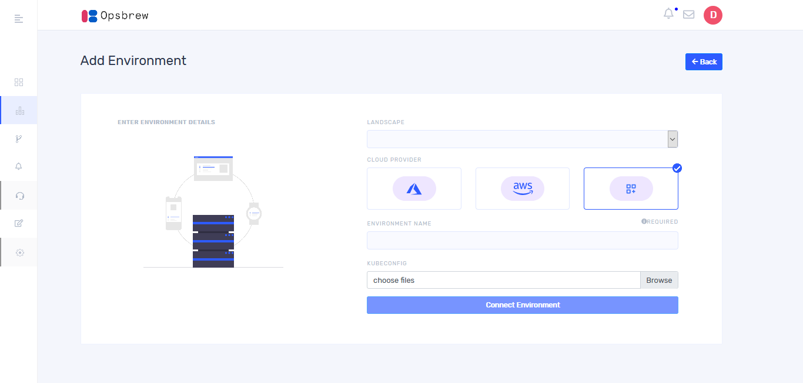
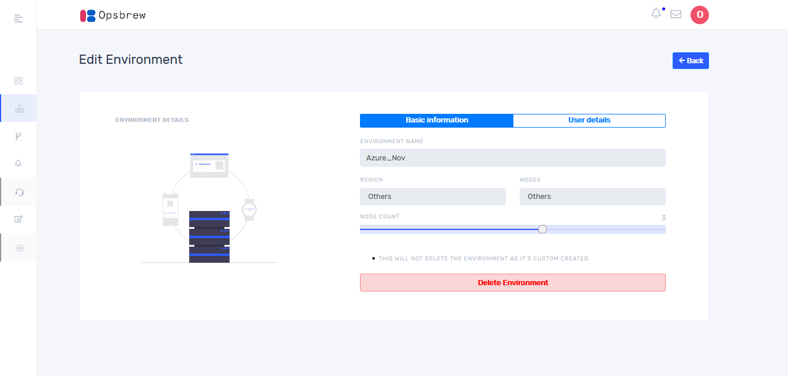
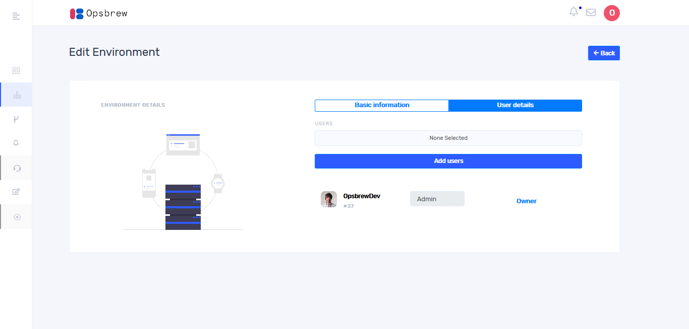

# Environments 
Basically, environment is a cloud platform. You can create multiple environments like AWS, Azure etc. under one organization.  

## Create Environment
Once you click “Environment” from the left side bar, it will take you to the following window

Click `+ Add Environment` button and select a cloud provider from the list. If you choose azure as a cloud provider, you will get a window as given below.   

Select landscape name from the drop down. Give App ID, Subscription ID, Password and Tenant of your azure account then give environment name and select region and nodes from drop down list. Also choose node count using seek bar then click `Create Environment`.  
If you choose aws as a cloud provider, you will get a window as given below.  

Give I am role ID of your aws account then give environment name and select region and nodes from drop down list. Also choose node count using seek bar then click `create environment`. 

If you choose custom cloud provider, then the following window will appear and you will have to provide a kubeconfig file during environment creation then click `Connect Environment`. 

 
Once environment is added/created, you can see it in the environments page. It shows all environments which you created.  For showing environments of a specific landscape, you could select landscape from the filter given in the top of the page.

The status of environment you can see in the board. When environment creation completes it shows ‘Environment running’. This confirms that the environment is ready to use.  

## Manage Environment 

Once you click settings button on the top right of the environment board, then the following screen appears. 

Here you can delete the environment. Environment can be deleted by the owner of environment and the users added into the environment with admin access.

Once environment is created there is no option for further editing in environment details. Only can add users into the environment. On clicking ‘User details’ tab you will get a window as below.

Here you can add users into your environment by selecting users from the fields. The role of the user can be edited from drop down and click `Update` button. 

