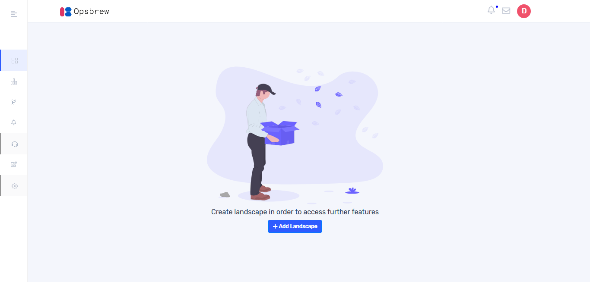
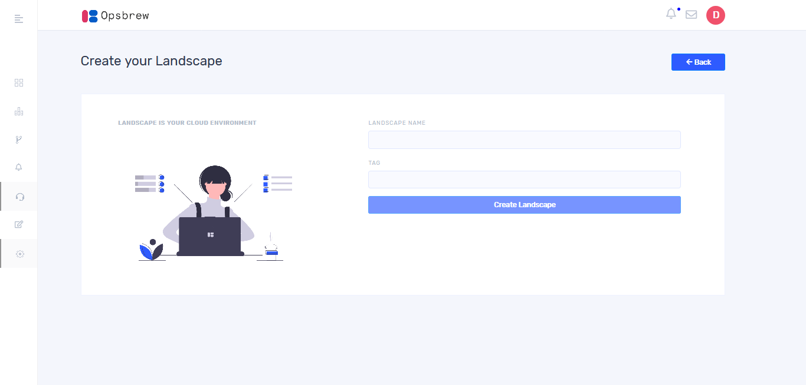
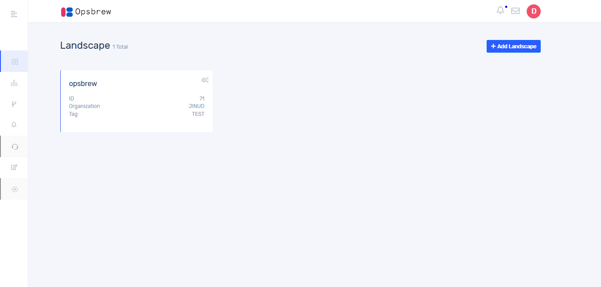
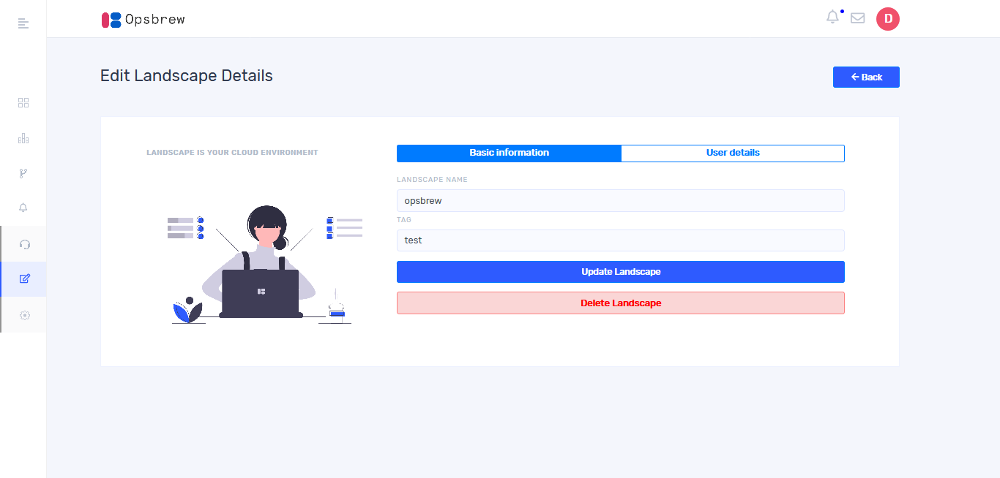

# Landscape 

Landscape is a logical grouping of environments. 

## Create Landscape 

Once you create an organization, you will get the following window. 

On clicking “+Add Landscape” you will get the following window. Give a proper name and tag then click “Create Landscape”. 

## Manage Landscape 

Once you create a landscape, it will be shown in landscape page as follows. 

Click on settings button provided on the top right of each landscape card. On the resulting edit landscape page you can edit landscape name and tag name. If you want to delete landscape click on `Delete Landscape`. 

