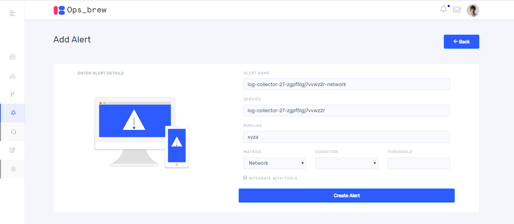
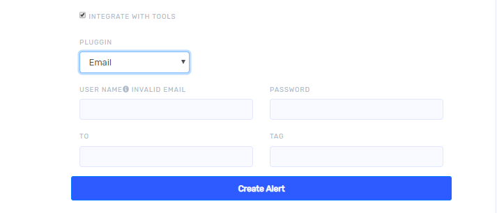
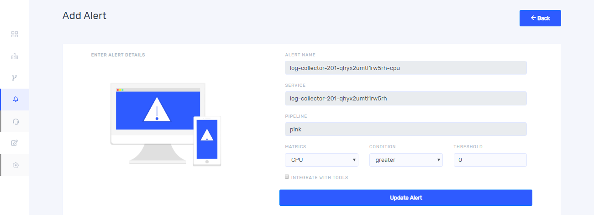

# Setting alerts for pipeline

You can define rules to enable capturing information about a running pipeline. You can enable an alert for any rule to be notified when the specified condition occurs. For setting alerts click on the three dots on the right top of  each chart. Then click `+ Add alert`.

Once you click `+Add Alert` it takes you to the following window. 

Select matrics type and condition from the drop down and give threshold value. For setting frequency of alert notification, you can select alert count and time interval from drop down. For sending alert notifications by email, slack, pager duty and teams untick `integrate with tools`. Same alert can be send with multiple notification channels.

## Alert notification by email  

If you select email from the drop down, give SMTP server then username and password of sender and give email address of receiver in ‘to’ field. After completing all the fields, click `Create Alerts`.

## Alert notification by slack 

For sending alert notification in slack , select `slack` from the  plugin drop down. For adding webhooks URL , click the link `incoming Webhooks in slack`. Add an appropriate tag.

After completing all the fields click `Create Alert`.

## Alert notification by Pager Duty 

For sending alert notification through Pager Duty, select Pager Duty from the plugin drop down then you can see the following fields. Fill Webhooks URL. For instructions to add webhooks URL, click the link ‘incoming Webhooks in pagerduty’. Give an email address and token then click `Create Alert`.

## Alert notification by Teams 

For sending alert notification through teams, select teams from the plugin drop down then you can see the following fields. Fill Webhooks URL. For instructions to add webhooks URL, click the link `incoming Webhooks in Teams`.

## Update and delete Alert  

You can see alert list by clicking on the alert button from left side bar. On clicking `Alert` you will get the following window. 

On clicking `View` button you will get the following window. you can update matrics, condition, threshold, and  frequency of alert notification by changing alert count and time interval. Notification Plugins also can interchange or add during updating alert. After editing fields click on `Update Alert`. For deleting an alert click `Delete Alert` button. 

