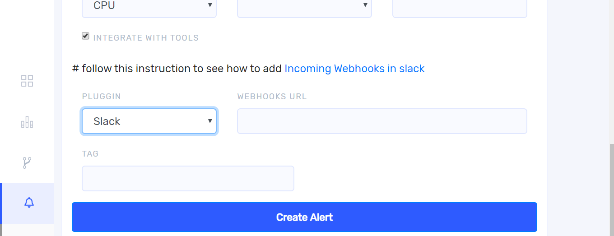

You can define rules to enable capturing information about a running pipeline. You can enable an alert for any rule to be notified when the specified condition occurs. For setting alerts click on the three dots on the right top of  each chart. Then click `+ Add alert`.

Once you click `+Add Alert` it takes you to the following window. 

Write the condition from the drop down and give threshold value. For sending alert notifications by email or slack, untick `integrate with tools`.

## Alert notification by email  

If you select email from the drop down, user name and password of sender should be specified and give email address of receiver in `to` field amd then add an appropriate tag. After completing all the fields, click `Create Alerts`.

## Alert notification by slack 

For sending alert notification in slack , select `slack` from the  plugin drop down. For adding webhooks URL , click the link `incoming Webhooks in slack`. Add an appropriate tag.

After completing all the fields click `Create Alert`.