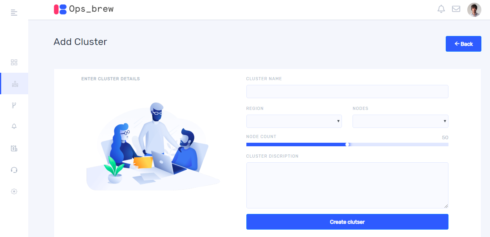
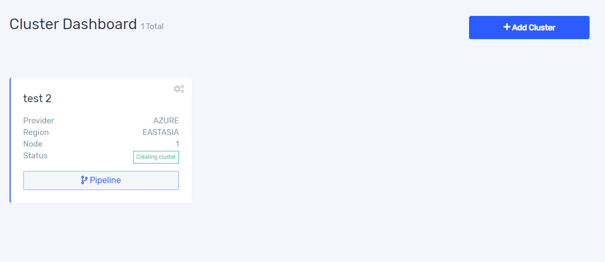
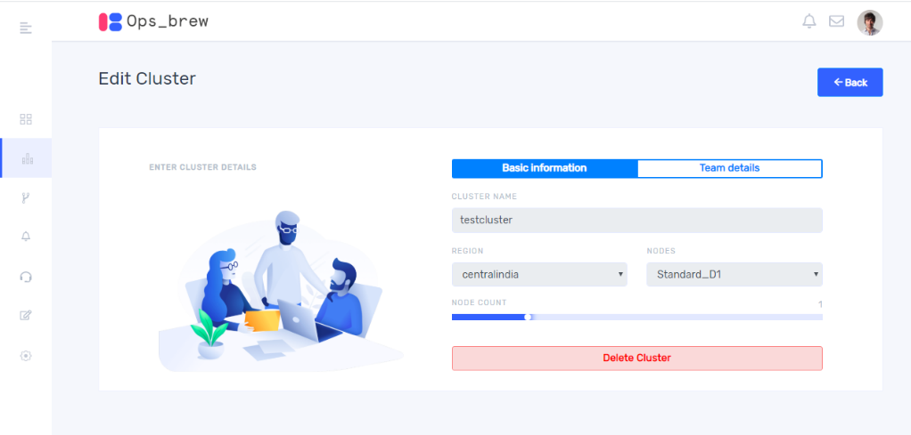
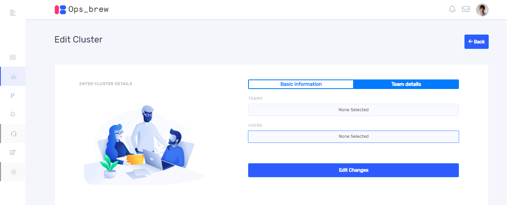

## Create cluster
Once you create a workspace, it will take you to the cluster dashboard window. On Clicking ‘+Add cluster’ you get a window as below. Give cluster name and select region and nodes from drop down list. Also select node count and Write cluster description then click create cluster. In case if more than one workspace was created, please select one among them before creating new cluster. 

Once cluster created you can see it in cluster dashboard. It shows only clusters corresponding to selected organization and workspace. For showing clusters of your other organization and workspace you should select organization from sliding window along with profile picture and workspace from the side bar on the left. 

The status of cluster you can see in the board. If cluster creation is failed, we can inspect the reason behind this by clicking on `cluster creation failed`.

## Delete cluster

Once you click settings button on the right top of the board, then the following screen appears, and you can delete the cluster here. Once cluster created there is no option for further editing. You can see the team details in the next tab. 

## Update cluster

Once you click settings button on the right top of the board, then the following screen appears. On clicking ‘Team details’ you will get a window as shown below. Here you can add users and teams into your cluster by selecting them from the fields. 

