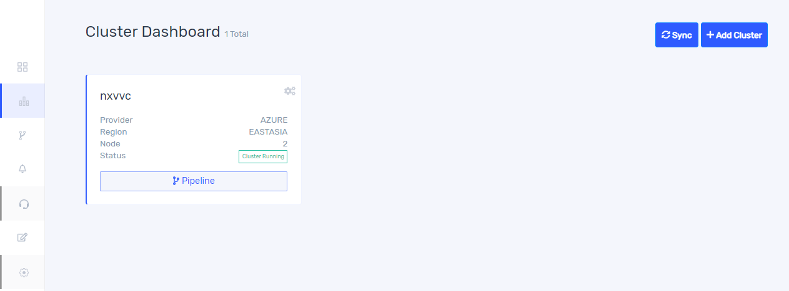

# Cluster

## Create cluster
Once you create a workspace, it will take you to the cluster dashboard window as shown below.

If you select azure as a cloud provider, on clicking `+Add cluster` you will get a window as below. Give cluster name and select region and nodes from drop down list. Also choose node count using seek bar and Write cluster description then click create cluster. In case if more than one workspace was created, please select one among them before creating new cluster. 

If you choose custom provider while creating workspace, you will get a window as below. Give cluster name and browse your kubeconfig file then click create cluster.

Once a cluster is added/created you can see it in cluster dashboard. It shows only clusters corresponding to selected organization and workspace. For showing clusters of your other organization and workspace you should select organization from sliding window along with profile picture. 

The status of cluster you can see in the board. Cluster creation will take 10 to 15 minutes. When cluster creation completes it shows `cluster running`. If cluster creation is failed, we can inspect the reason behind this by clicking on the `cluster creation failed`.  

## Delete cluster

Once you click settings button on the top right of the board, then the following screen appears, and you can delete the cluster here. Cluster can be deleted by the owner of cluster and the users added into the cluster with admin access.

## Update user and team details in cluster 

Once cluster created there is no option for further editing in cluster details. Only can add users and teams into the cluster. Once you click settings button on the top right of the board, then the following screen appears. On clicking `User details` tab you will get a window as below. Here you can add users into your cluster by selecting users from the fields. The role of the user can be edited from drop down and click `Update` button. 

On clicking `Team details` you will get the following window. You can add team from your workspace into your cluster by selecting team and clicking `Add Teams`. Role of the team can be edited here.

