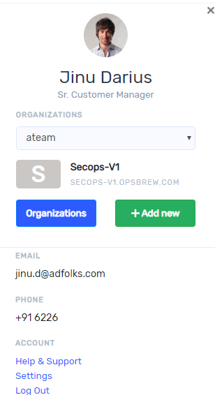

## Account Creation

Users who do not have an Ops_brew application account can select “sign up” to get access.  If already signed up, you need to sign in. 

## Create Organization

Before doing anything in Ops_brew platform you must create an organization. Once you click “sign up” it takes you to sign-up page as shown below. The name of organization must be unique. Once you sign into Ops_brew account, you are already a part of an organization. In sign- up window organization name is a mandatory field.

After sign in you can see your organization and you can also add more organization by clicking persona icon on the top right corner then click ‘+ Add new’. On clicking profile picture, you get a window as below. if you have more organization, you can select organization from drop down list. You can also see the workspace name in the window.

