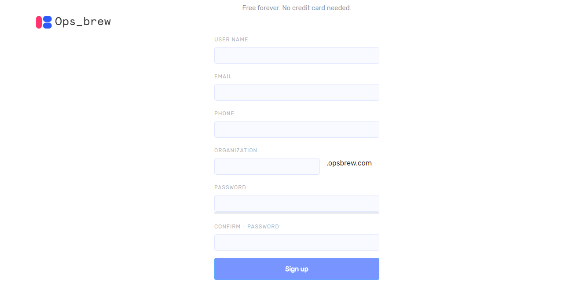
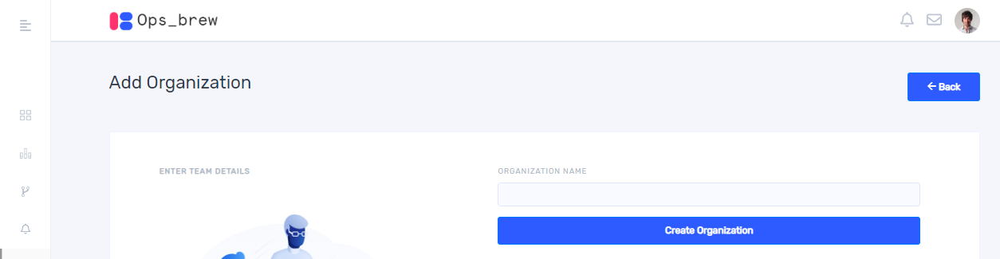
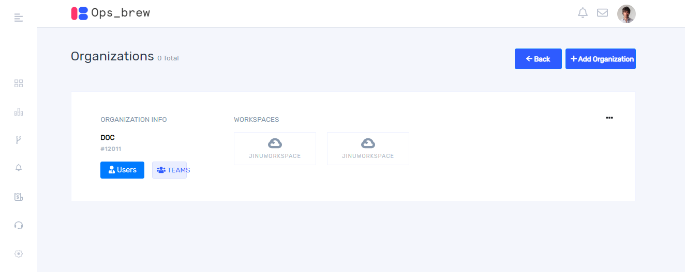
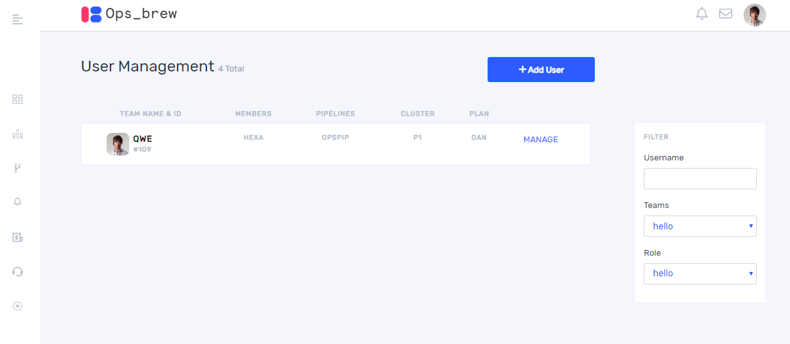
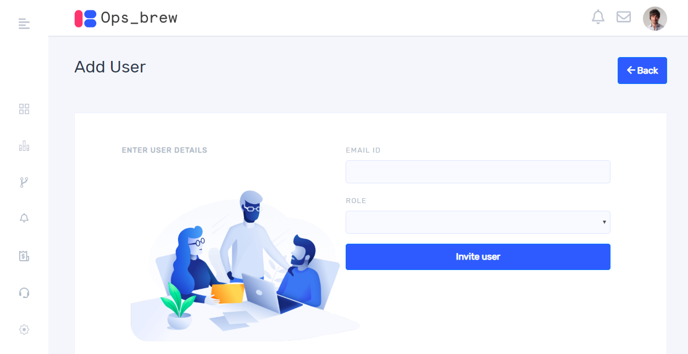
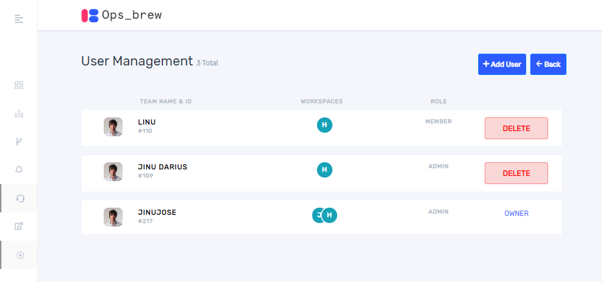
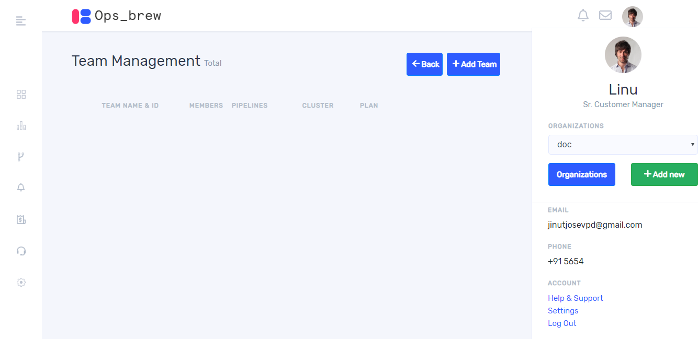
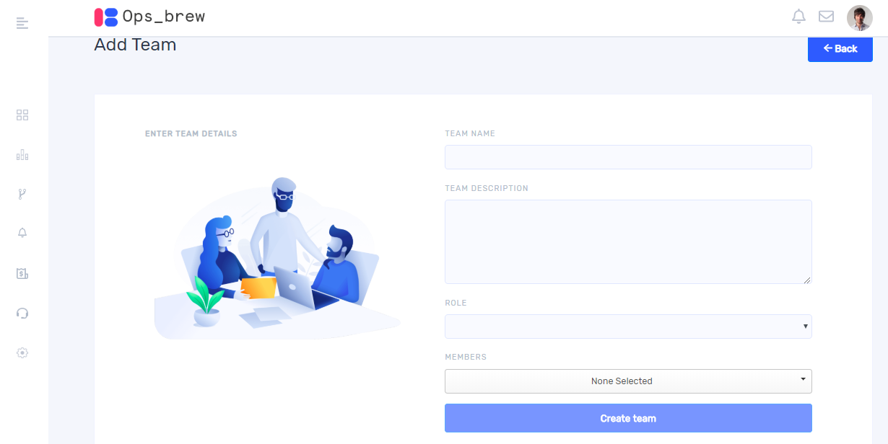
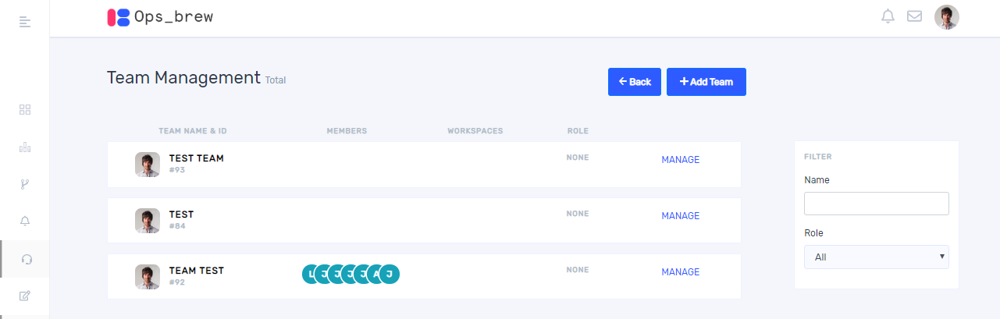
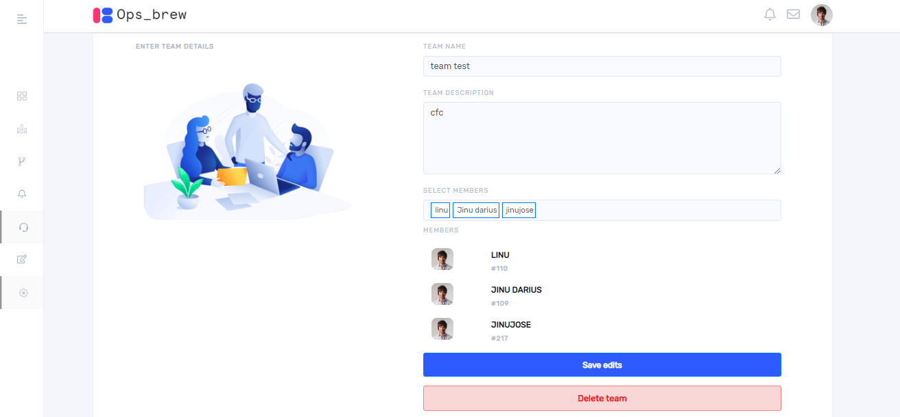

Organization is the top most level of the hierarchy. Before doing anything in Ops_brew platform you must create an organization.

## Create Organization

Once you click `sign up` it takes you to sign-up page as shown below.  Organization name is a mandatory field and must be unique. After Completing all the fields in sign- up window click `sign up`.

Once you sign into Ops_brew account, you are already a part of an organization and you can see your organization details by clicking persona icon on the top right corner. On clicking there, you get a window as below.

For adding new organization, click ‘Add New’ then you will get the following window. 

Give the organization name, then click ‘Create organization’.  

## User

### Add user

On clicking on the top right persona icon, you will get the below window. Then click organizations button.

Here you can add users and teams into an organization.

On clicking `users` button, we get the below window.

Once you click `+ Add User`, it takes you to the invite user window as shown below. 

You can invite a user to our organization by giving email ID and role. The role of the user can be decided by the owner of the organization. Choose from among the three roles from the drop down. 

   1. Admin (read, write, delete)   
   2. Collaborator (read, write) 
   3. Member(read) 

On clicking invite user, an invitation email will send to the user. Click the link which appears in the email to go to the sign-up page. If the user who is invited by organization has already got an Ops_brew account, an intimation email will be sent. The user can join to the organization from the notification panel.

### Delete user 

If you added more users in your organization, you can see all of them in users list as follows. For deleting a user click `delete` button.  

## Team

Teams are subsets of people in your Organization who collaborate with each other. When a member first joins an Organization, they are not automatically added to any team within that Organization. Each person must create or join teams within the Organization. 

### Create team 

Create a new team to begin collaborating with your team in an Organization. 

We can add team by clicking `+ Add Team`. 

Fill all the fields in the Add team window and click on `create team`.

### Delete team 

If you want to delete a team from your organization, click `Manage` button corresponding to the team name. 

On clicking `Manage` button you will get a window as below. 

On clicking `Delete` button, you can remove the team from your organization. 

### Update team 

For updating a team, click manage button along with the team name. If you want to add or remove members to your team, there is an option provided for selecting members. When you click manage button you will get a window as shown below. 

After completing all fields click `Save edits`.
