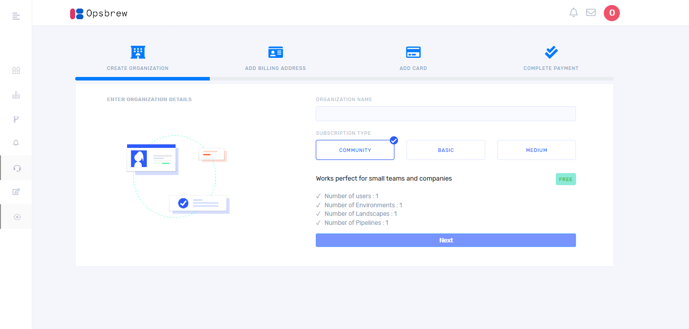
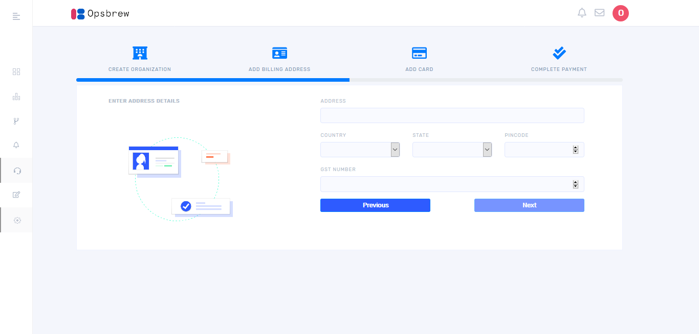
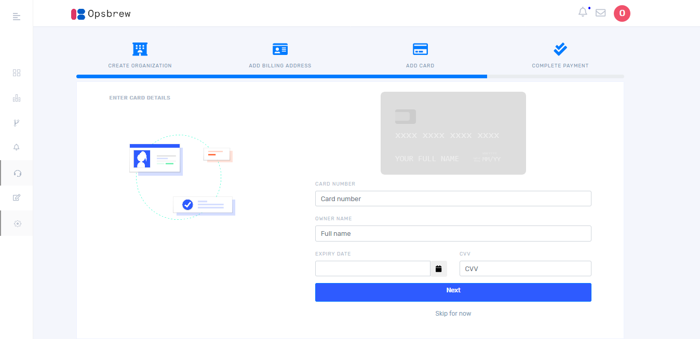
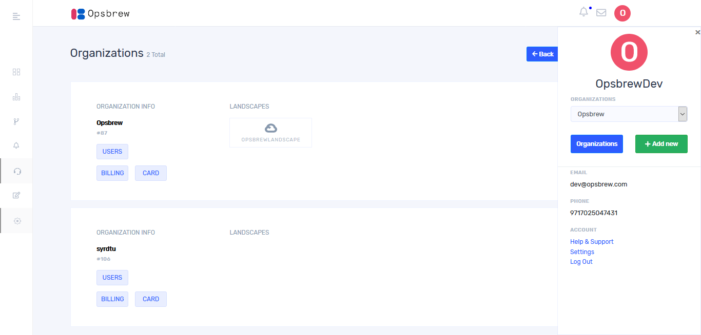
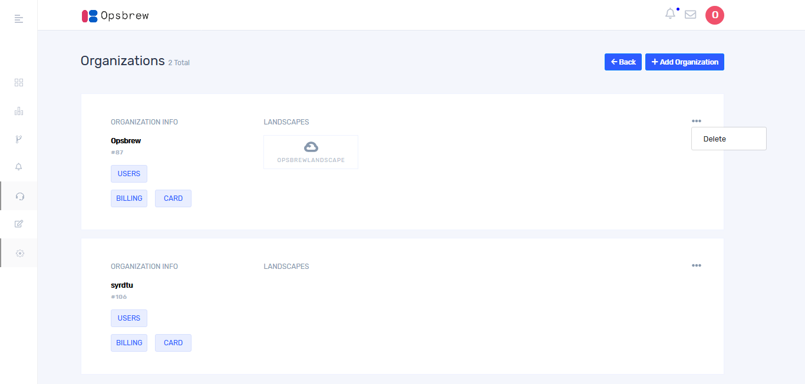
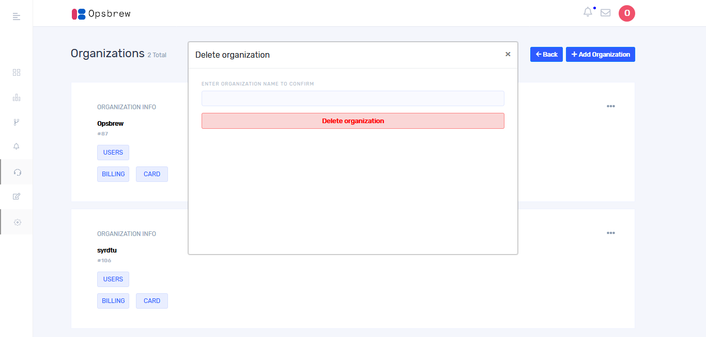
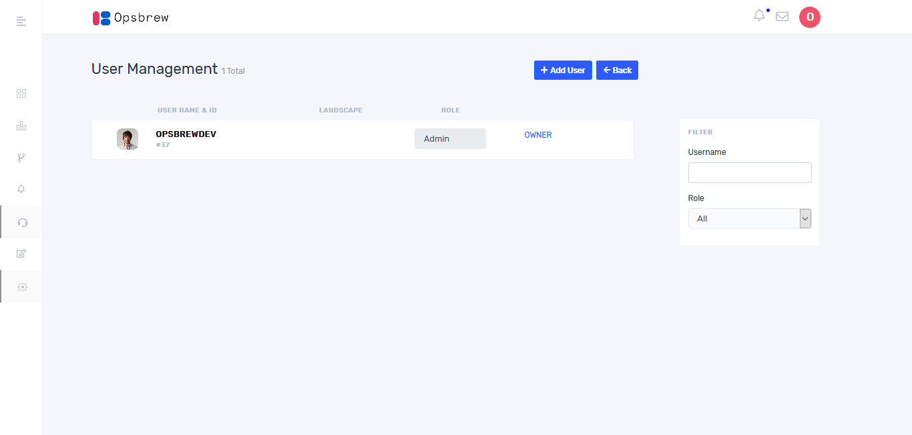
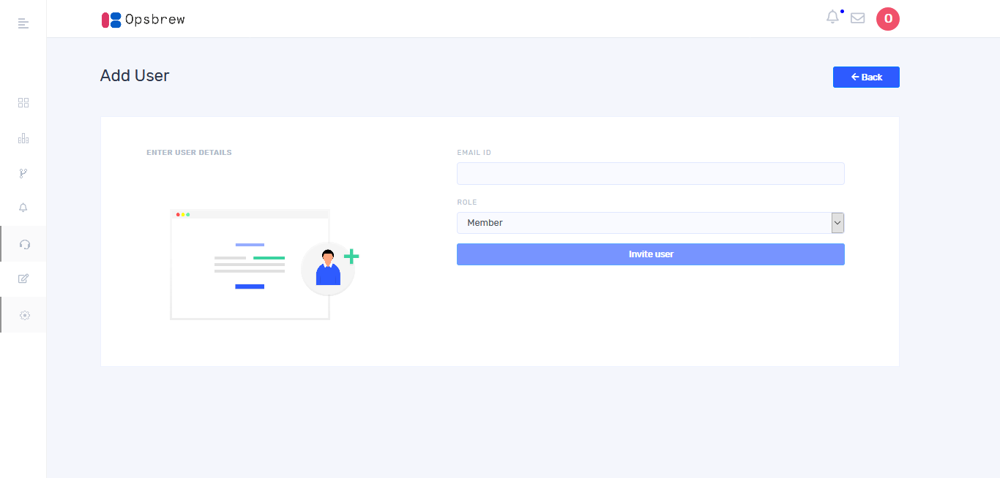
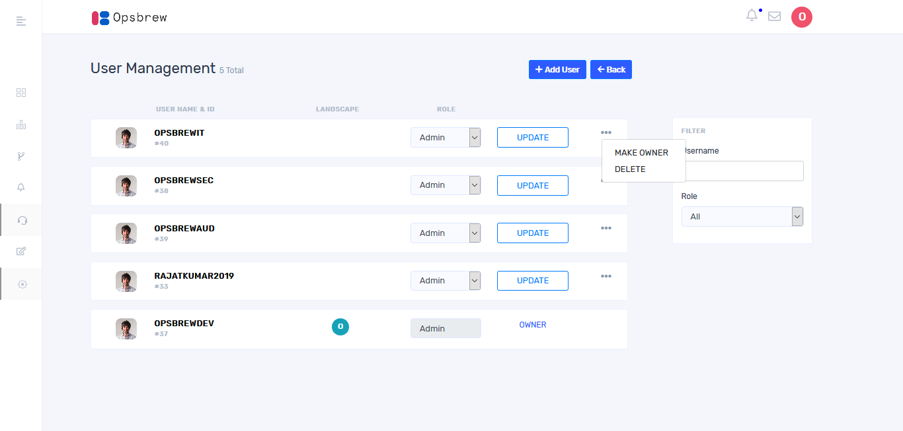

# Organization

Organization is the top most level of the hierarchy. You have to create an organization in order to access further features. 

## Create Organization

Once you successfully signed in, it takes you to the following window.

Enter organization name and select an appropriate subscription type and click `Next` then it takes you to the following window. Here you must give the billing address details. 

Enter address then select country and state from the drop down. After completing all the fields click   `Next` then you will get a window as below.  

Enter card details and click `Next` then the following window will appear. Select an appropriate payment method from dropdown and click `Confirm Payment`. 

## Delete Organization

  
You can see your organization details by clicking profile picture icon on the top right corner. On clicking there, you will get a window as below. 

Once you click organizations, it takes you to the following window. Then you can see list of organizations which you have created. Then click on three dots provided at the right end of the screen corresponding to each entry.

Then you will get the following window. Enter the name of organization to confirm deletion. Organization can be deleted only by the owner of the organization. 

## Add users

Once you click `Users`, it takes you to the invite user window as shown below

Once you click `+ Add User` it takes you to the invite user window as shown below. 

 You can invite a user into your organization by entering email ID and role. The role of the user can be decided by the owner of the organization. Choose one among the two roles from drop down. 
1.	Admin (Access to read, write and delete.) 
2. Member(Read only access) 
On clicking invite user, an invitation email will send to the user. Click the invitation link in the email, which will take you to the sign-up page. If the user who is invited by organization has already got an Opsbrew account, an intimation email will be sent. The user can join to the organization from the notification panel in the Opsbrew console.

## User management 

If you added more users in your organization, you could see all of them in user management window as follows.

 

On clicking three dots provided towards the right end of the corresponding entry, you will view `Delete` button. If you want to change the role of the user in your organization, select the role from the drop down and click `Update` button. If you want to give the ownership of organization to other users, click on dots given in the right side of corresponding user and select `make owner`. 

