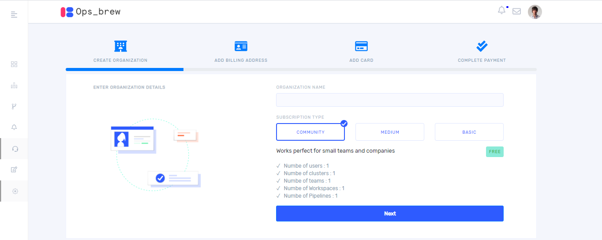
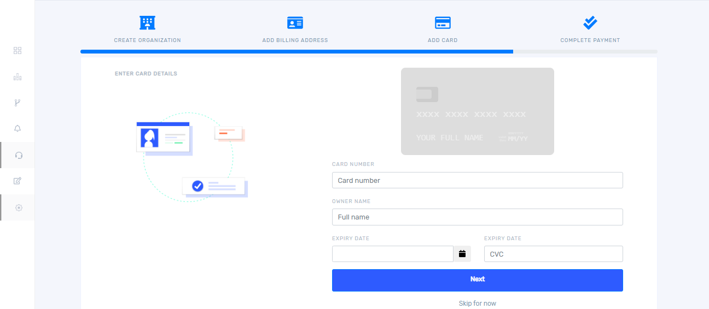
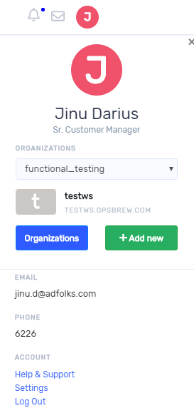

# Organization

Organization is the top most level of the hierarchy. You have to create an organization to continue on the signup process. 

## Create Organization

Once you click `sign in` it takes you to the following window. 

Give organization name and select an appropriate subscription type and click ‘Next’ then it takes you to the following window. Here you must give the billing address details.

Give address and select country and state from the drop down. After completing all the fields click `Next` then you will get a window as below.

Enter card details and click `Next` then the following window will appear. Select an appropriate payment method from dropdown and click `Confirm Payment`. 

## Delete Organization

You can see your organization details by clicking the profile picture on the top right corner. On clicking there, you will get a window as below.  

Click Organizations, then you can see list of organization and then click three dots on the top right.  

You will get the following window. Enter the name of organization to confirm deletion. Organization can be deleted only by the owner of the organization. 

## User

### Add users

On clicking organization, you will get the following window. Here you can add users and teams into an organization.  

On clicking `users` button, you will get the below window 

Once you click `+ Add User` it takes you to the invite user window as shown below. 

You can invite a user to your organization by entering email ID and role. The role of the user can be decided by the owner of the organization. Choose one among the three roles from drop down. 

   1. Admin (read, write, delete)   
   2. Collaborator (read, write) 
   3. Member(read) 

Click the invitation link in the email, which will take you to the sign-up page. If the user who is invited by organization has already got an Ops_brew account, an intimation email will be sent. The user can join to the organization from the notification panel inside Ops_brew console. 

### Delete user 

If you added more users in your organization, you could see all of them in user management window as follows. For deleting a user click `delete` button.  

Update user 

 

If you want to change the role of the user in your organization, select the role from the drop down as shown below and click `Update` button. 

## Team

Teams are subsets of users in your Organization who collaborates with each other and shares a common role. When a member first joins an Organization, they are not automatically added to any team within that Organization. Each user must create or add users into teams within the Organization. 

### Create team 

Create a new team to begin collaborating with your team in an Organization. 

We can add team by clicking `+ Add Team`. 

Give the team name, team description and role then select members who are already in the organization to the team and click `create team`.

### Delete team 

If you want to delete a team from your organization, click `Manage` button corresponding to the team name. 

On clicking `Manage` button you will get a window as shown below. 

On clicking `Delete` button, you can remove the team from your organization. 

### Update team 

For updating a team, click manage button along with the team name then you will get a window as shown below. You can change team name and team description from the first tab. If you want to add or remove members to your team, click user details tab. There is an option provided for selecting members then click `Add users`.

