# Pipeline

## Create Pipeline

You can create pipeline by clicking `Pipeline` in the cluster dashboard or from pipeline icon from left side bar. Once you click, then the following screen will appear. 

On clicking `+ Add Pipeline` you will get the following window. Give pipeline name and select cluster from drop down. You can add users and teams into your pipeline by selecting them. After completing all the fields click `create pipeline`. 

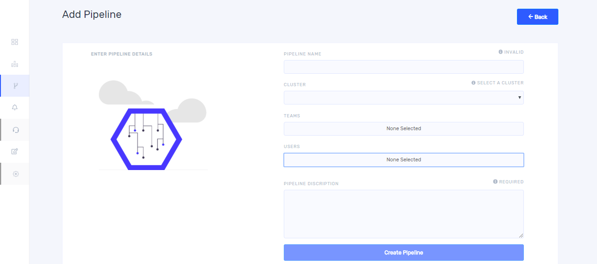

After pipeline creation you will get a window as shown below. 

## Import and Export pipeline template 

### Import 

There is an import button provided on the top right of the screen when you enter first time. On clicking ‘import’ button you will get the following window.

You can choose a template and click ‘import’ then you can add an already existing pipeline. so that configurations from other pipelines can be reused so as to avoid starting from scratch during each additional pipeline creation. If there are any plugins in the canvas, you won’t be able to import

### Export 

After pipeline creation, you can see `Export` button on the top right. On clicking it you can download the pipeline and can reuse it. 

## Connecting plugins 

From left side bar you will get sources, connector, and alert by clicking ‘+’ along with these, you can drag and drop these plugins to the canvas. 

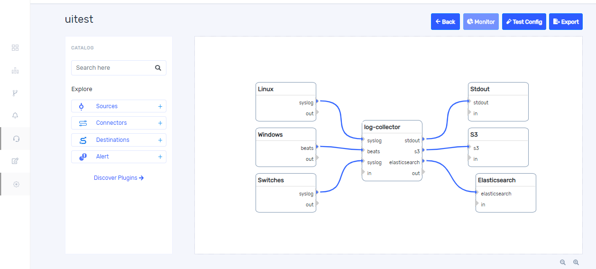

You can connect each plugin with lines as shown above. For drawing lines between plugins click on the output of the source plugin and then click on the input of the connector without dragging. Repeat the same for connecting the connector with the next component. Each link and plugin should be configured before building pipeline. The link which is not configured is shown in grey color. If the plugin has only one output, configuration of link is done automatically and link color turns into blue. 

## Configure Link

If you connect a plugin having more than one output, link doesn’t configure automatically. For configuring and deleting link, bring cursor on the link and click on it when mouse pointer becomes arrow then you will get a window as shown below. 

In this example we are configuring linux output link. Once you click on ‘configure linux output’, it takes you to the following window.  

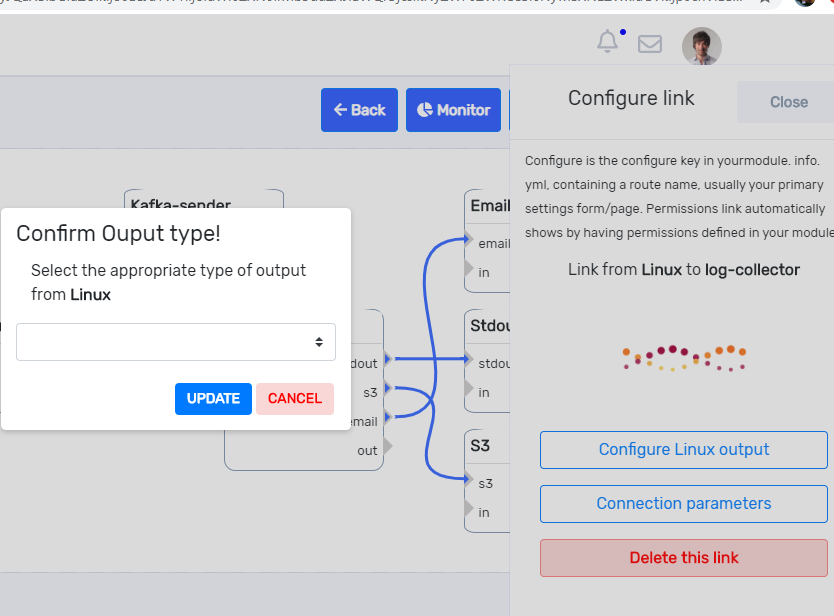

From the drop down you can select the appropriate type of output from linux  and click ‘update’ button and on clicking ‘connection parameters’ you will get the following window. 

Complete all the  fields and click `save`. For each plugin connection parameters are different and give the proper values while configuring link. If you configured all the connecting links, all links turn to blue as shown below. 

## Configure source Plugin 

For configuring each source plugin, click on the top of the plugin name then you will get the following window. 

You can delete the source plugin. 

## Configure Connector Plugin 

On clicking the top of the log connector plugin in the canvas you will get the following window 

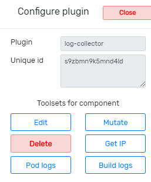

### Edit 

On clicking edit, you will get a window as shown below where in the configurations can be edited in json format. 

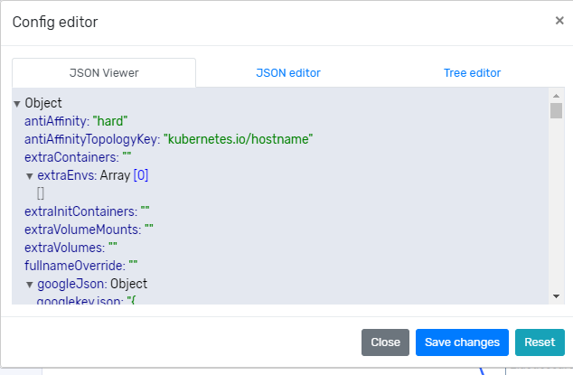

### Get IP

On clicking `Get IP`, you will get a window as shown below. 

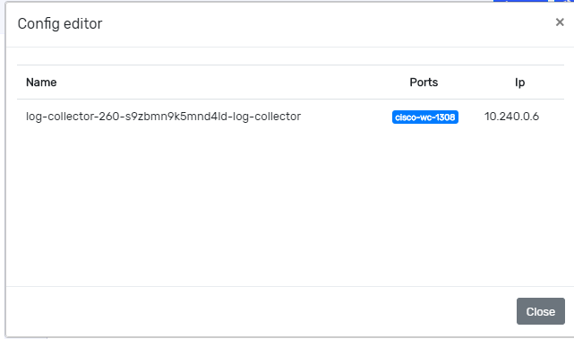

You can view IP address as well as the ports from this window. You may have to use this IP address to configure the sources for sending logs to our log collector. 

### Build logs 

On clicking build logs, you will get a window as shown below. It shows the successful as well as failed stages during log collector build. 

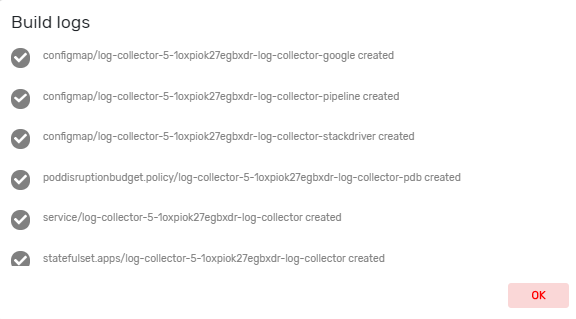

### Pod logs 

If you want to see application logs, click on pod logs then you will get the following screen 

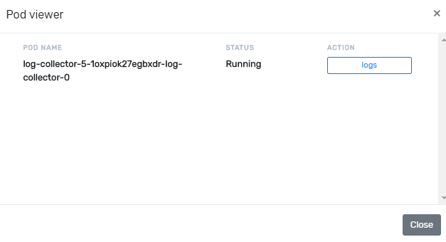

On clicking ‘logs’ on the top right, you will get the following window which shows the real time logs for the applications 

### Mutate 

The mutate filter allows you to perform general mutations on fields. You can rename, remove, replace, and modify fields in your events. 

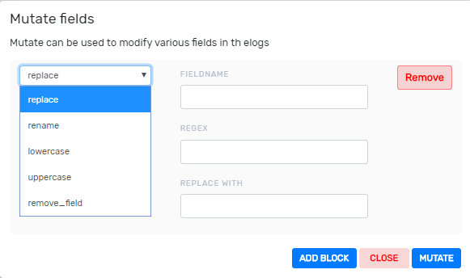

## Configure destination plugin 

### Filter  

A filter plugin performs intermediary processing on a log. Filters are often applied conditionally depending on the characteristics of the log. During configuring output plugin, you can see filter button, on clicking it takes you to the following window. From the dropdown, you can select an appropriate condition for filtering. 

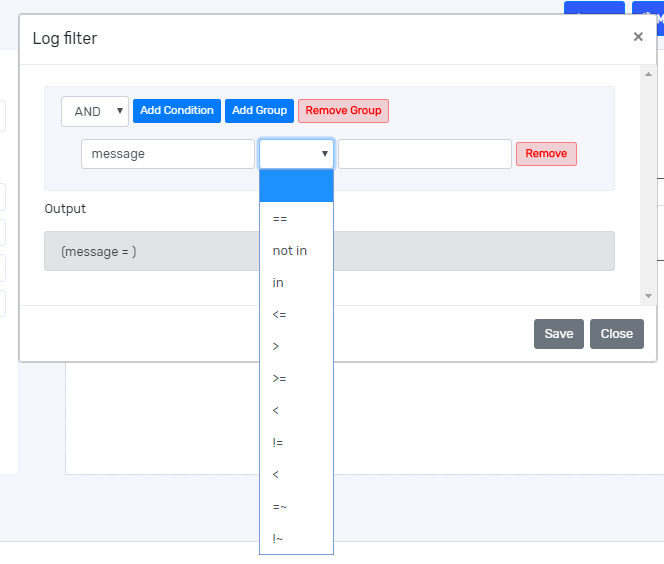

### Life cycle 

Life cycle is used for setting retention period for logs by categorizing them based on keywords. On clicking life cycle, you will get the following window. 

In this example, S3 is used as destination. Complete all the fields and click `Apply Lifecycle`.

## Configure alert plugin 

If you add alert plugins like email, slack, PagerDuty etc.in your pipeline, you can see an alert button while configuring. On clicking alert button, you will get the following window 

Alert conditions can be entered in the window. 

### Test config 

After configuring all plugin click `Test config` then it shows the following pop up then click `Render`. 

After rendering a build button appear on the top right of the window then click `Build` button. After pipeline creation, you can see ‘Export’ button on the top right; On clicking it you can download the pipeline and reuse.  

Once you create pipeline, you can see it in pipeline dashboard as shown below. you can click build console for building your pipeline. A filtering option provided at right hand side for a quick search. For adding more pipelines click `+ Add Pipeline`. Pipeline dashboard shows only pipelines corresponding to selected organization and workspace. 

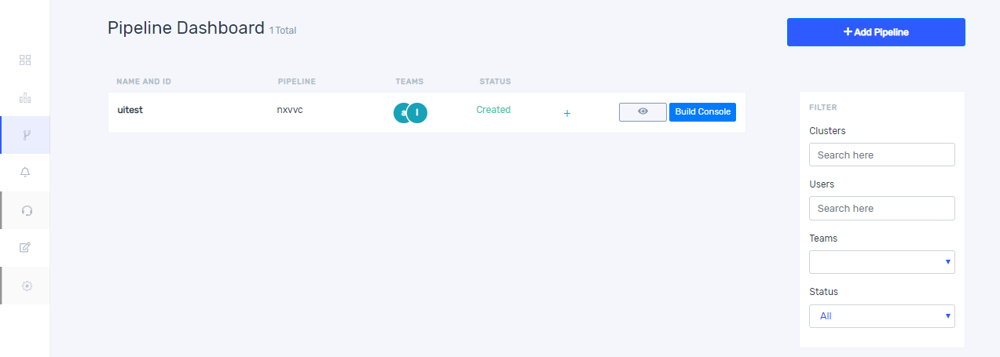

An eye icon provided in the window for monitoring. 

## Monitoring 

You can see ‘Monitor’ button on the right top after build a pipeline. You can go to the monitor dashboard from eye icon provided on pipeline dashboard. clicking monitor button you get a window as below. 

For viewing charts, click ‘+ Pipeline dashboard’ then you get the following window then click ‘+Add chart’. 

Once you click ‘+ Add chart’, it takes you to the following widow. 

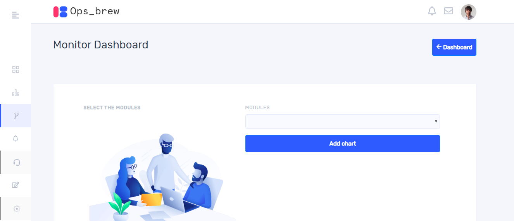

Modules can be  selected from the drop down. Then click ‘Add chart’. You can alternate between charts for cpu, network and memory. If you want see all the charts together add more charts and select appropriate ones from the drop down. 

## Discover plugin 

You can also see discover plugins on the bottom of left side bar. Once you click on the “discover plugin” it will show you more details of each plugin as shown below. 

## Update user and team details in pipeline 

For updating pipeline, click `+` icon corresponding to a pipeline in the pipeline dashboard then you can see edit button. Once you click edit button it takes you to the following window. On clicking `user details` you get a window as below. 

For adding users to your pipeline, select users then click `Add user`. On clicking `Team details` you get a window as below. Here you can add teams by selecting team from the field. 

## Delete pipeline 

When you click edit button from pipeline dashboard, you will get a window as below.

If you want to delete a pipeline, click `basic information tab` then you can see delete button.

