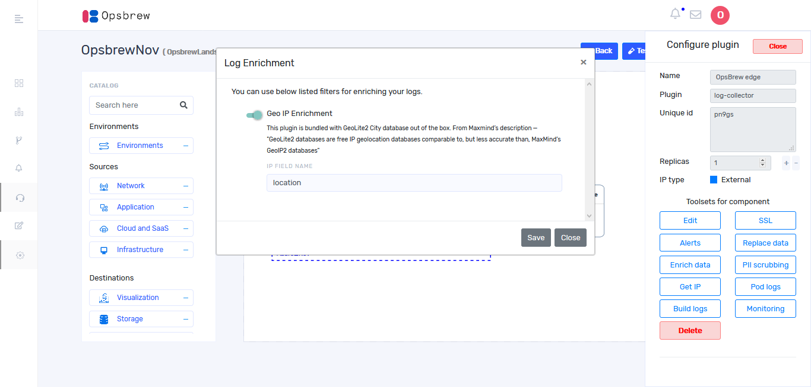
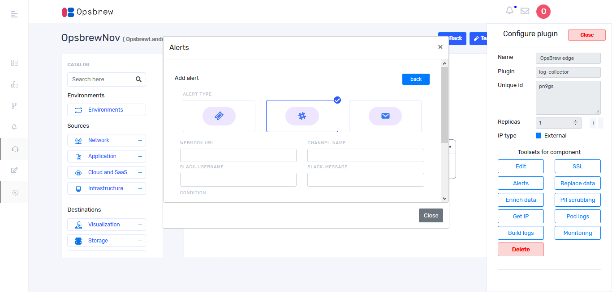

# Pipeline
Create pipelines, this is where you are going to build the pipeline that suit your needs. We support combination of disparate environments such as AWS and Azure, etc. sources or destination for a given pipeline. 

## Create Pipeline

You can create pipeline by clicking `Pipeline` icon provided in the left side bar. On clicking `+ Add Pipeline` you will get Add pipeline window. Select landscape from drop down and give pipeline name. You can add users into your pipeline by selecting users from drop down then enter pipeline description. After completing all the fields click `Create pipeline`. 

After pipeline creation you will get a window as shown below. 

You can create your pipeline in this window. Environments, Sources and Destinations are provided in the left side bar. Select components from these according to your requirements. Also, a search bar is provided for quick search.  

## Connecting plugins 

From left side bar you will get plugins and can drag and drop these plugins to the canvas. You can connect sources and destination from combination of environments with lines. For drawing lines between plugins click on the output of the source plugin and then click on the input of the Opsbrew edge without dragging. Repeat the same for connecting Opsbrew edge with the next component. Each link should be configured before building pipeline.  If the plugin has only one output type, configuration of link is done automatically and link color turns into blue. If you connect a plugin having more than one output, link doesn’t configure automatically, and is shown in grey color. 

## Deleting Plugins

For deleting a plugin which is added in the canvas, click on the plugin and it takes you to configure plugin window as shown below. Then click on `Delete`button. 

## Configure Link 

For configuring link, bring cursor on the link and click on it when mouse pointer becomes hand cursor and link becomes darker. If you click on the link from source to Opsbrew edge, then you will get a window as shown below.

In this example we are configuring Linux’s output link. Once you click on `Configure Linux output`, it takes you to the following window.

From the drop down you can select the appropriate type of output from Linux and click `update` button. Once you configure link, connection parameters will appear in the configure link page as follows.

For each plugin connection parameters are different and give the proper values. In most of the cases we provide default connection parameters. Before building pipeline, all the parameters should be filled out. 

## Build pipeline 

If you configured all the connecting links, all links turn into blue as shown below. 

On clicking ‘Test config’ it will show the following pop up then click ‘Render’. 

After rendering a build button appear on the top right of the window then click ‘Build’ button.

## Configure  Opsbrew Edge

On clicking top of the Opsbrew Edge in the canvas, you will get the following window 

### Edit 

On clicking edit, you will get a window as shown below where in the configurations can be edited in json format. 

### SSL 

On clicking SSL, it takes you to the following window. SSL is used is to keep sensitive information sent across the Internet encrypted so that only the intended recipient can access it. Give all details of SSL and click `Save` button. 

### Get IP 

On clicking ‘Get IP’, you will get a window as shown below. 

You can view IP address as well as the ports from this window. You may have to use this IP address to configure the sources for sending logs to our Opsbrew edge. 

### Build logs 

On clicking build logs, you will get a window as shown below. It shows the successful as well as failed stages during pipeline build. 

### Pod logs

If you want to see application logs, click on pod logs then you will get the following screen 

On clicking ‘logs’ on the top right, you will get the real time logs for the applications.

### Replace Data

On clicking `Replace Data` you will get the following window. The mutate filter allows you to perform general mutations on fields. You can rename, remove, replace, and modify fields in your events.

### Enrich Data 

On clicking `Enrich Data` you will get the following window. Enable Geo IP Enrichment switch. 

### PII scrubber

Mask PII data without spending time working with regular expressions.From configure plugin, select `PII Scrubber`. It takes you to the following window. 

### Alerts 

Click on `Alert` button in the configure plugin window then click on `Add Alert` button and you will get the following window.

Select an appropriate alert type from the list. If you select slack, you will get the following window. Then fill out all fields. 

Alert conditions can be set according to your requirements as shown below. 

### Monitoring 

Monitoring is available for your pipeline and components. 

#### Log Analytics Dashboard  

On clicking `monitoring` button you will get the following window. 

First graph shows log flow. The path of the logs from sources to destinations can be easily understood from the graph. On hovering at the bright vertical lines of each log type, the path will become brighter. When bringing cursor to each component, the number of logs from sources to destinations are displayed. 

The second graph is host wise log analytics; you will get the log count for each host. A filter option is given on the top right for filtering hosts. You can set the time duration from the drop down which will appear after selecting the host name and you will get log count of the given host. You can also see host wise liveness status as shown below. The hosts which are sending logs will be shown with green light rest will be shown with red light. 

#### Health Dashboard 

On clicking `Health dashboard` on the top right, you will get a window then click `+Add chart`. Once you click `+ Add chart` it takes you to the following window. 

Modules can be selected from the drop down. You can alternate between charts for cpu, network and memory. If you want to see all the charts together add more charts and select appropriate ones from the drop down. 

## Import and Export pipeline template 

### Import 
 
There is an `import` button provided on the top right of the screen when you enter to pipeline page first time. You can choose a template and click `import` then you can add an already existing pipeline. so that  other pipelines can be reused so as to avoid starting from scratch during each additional pipeline creation. If there are any plugins in the canvas, you won’t be able to import pipeline. 

### Export 

After pipeline creation, you can see `Export` button on the top right. On clicking it you can download the pipeline and can reuse it. 

## Discover plugin 

You can also see discover plugins on the bottom of left side bar. Once you click on the `discover plugin` it will show you more details of each plugin as shown below. 

## Manage Pipeline  

Once you create pipeline, you can see it in pipeline dashboard as shown below. 

For adding more pipelines click `+ Add Pipeline`. Pipeline dashboard shows all the pipelines of selected organization. There is a filter provided on the top for listing pipelines under selected landscape. 

For updating pipeline, click ‘+’ icon corresponding to each pipeline in the pipeline dashboard then you can see edit button. Once you click edit button it takes you to the following window. If you want to delete a pipeline, click `basic information` tab then you can see delete button and click on it.

You can also edit pipeline name here. After editing click on `Update pipeline`. 

On clicking `user details` tab you will get a window as below.  

