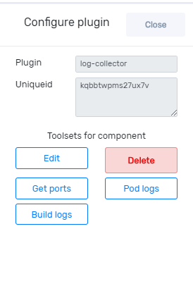

## Create Pipeline

Once you click ‘Pipeline’ in the cluster dashboard, then the following screen will appear. Complete all the fields and click `create pipeline`. 

You can select pipeline name and click build console for building your pipeline. A filtering option is provided at the right hand side for a quick search. 

An eye icon provided in the window for monitoring.  

## Update Pipeline

For updating pipeline, click ‘+’ icon corresponding to a pipeline in the pipeline dashboard then you can see edit button. Once you click edit button it takes you to the following window. On clicking ‘user details’ you get a window as below. 

For adding users to your pipeline, select users then click ‘Add user’. On clicking ’Team details’ you get a window as below. Here you can add teams by selecting team from the field. 

## Delete pipeline 

When you click edit button you will get a window as below.

If you want to delete a pipeline, click ’basic information tab’ then you can see delete button.

## Build pipeline 

On clicking build console in the pipeline dashboard, you will get a window as below. From left side bar you get sources, connector and destination by clicking ‘+’ along with these, you can drag and drop each one and also a search bar is provided for quick search.  

You can connect each plugin with lines as shown above. For drawing lines between plugins click on the output of the source plugin and then click on the input of the connector without dragging. Repeat the same for connecting the connector with the next component. Each link should be configured before building pipeline. 

For configuring and deleting link, bring cursor to the link and click on it when the link becomes dark, then you will get a window as shown below. 

In this example, we are configuring a linux output link. Once you click on ‘configure linux output’, it takes you to the following window. From the drop down you can select the appropriate type of output from linux  and click ‘update’ button.  

On clicking on the top of each component, you can go to ‘configure plugin’ and can delete plugin there. After configuring all plugin click ‘Test config’ and then click ‘build.

## Monitoring 

You can see ‘Monitor’ button on the right top after build a pipeline. You can go to the monitor dashboard from eye icon provided on pipeline dashboard. clicking monitor button you get a window as below. 

For viewing charts, click ‘+ Pipeline dashboard’ then you get the following window then click ‘+Add chart’. 

Once you click ‘+ Add chart’, it takes you to the following widow. 

Modules can be  selected from the drop down. Then click ‘Add chart’. You can alternate between charts for cpu, network and memory. If you want see all the charts together add more charts and select appropriate ones from the drop down. 

## Discover plugin 

You can also see discover plugins on the bottom of left side bar. Once you click on the “discover plugin” it will show you more details of each plugin as shown below. 

