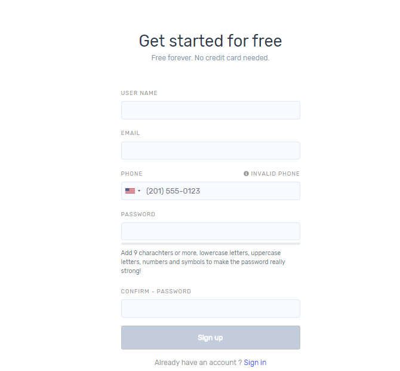
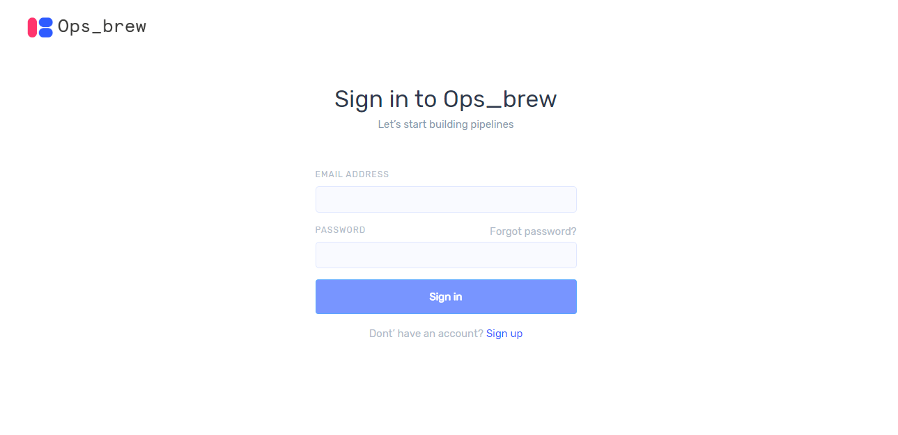
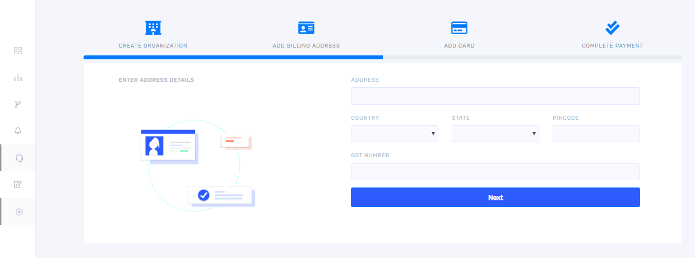

## Sign Up

Users who do not have an Ops_brew application account can select `sign up` to get access.  If already signed up, you need to sign in. 

Give a username and valid email address then select country and give valid phone number. Set a password and confirm it then click `sign up`. 

If already signed up, you need to sign in. 

## Organization

### Create Organization

Once you click `sign in` it takes you to the following window. 

Give organization name and select an appropriate subscription type and click ‘Next’ then it takes you to the following window. Here you must give the billing address details.

Give address and select country and state from the drop down. After completing all the fields click `Next` then you will get a window as below.

Enter card details and click `Next` then the following window will appear. Select an appropriate payment method from dropdown and click `Confirm Payment`. 

## Workspace

Workspace is an isolated space specific to a cloud provider or a custom provider and needs to be created after organization creation in order to access further features. Each workspace you create will be connected to a specific cloud environment.

### Create workspace

Once you successfully created organization, you will get a window as shown below.

On clicking `+ Add workspace` you will get 'create your workspace' window. Give an appropriate name in the `workspace name` field. You can create workspace in both Azure and AWS and a custom workspace is also provided. 

Give the workspace name and select one cloud provider and click `Connect Workspace`.

### Azure workspace

If you select Azure, you must give app id, subscription id, password and tenant id in appropriate fields as shown below.

After completing all the fields click `Create workspace`.

### Custom workspace 

If you select the second custom provider, you will get the following window. 

Give workspace name and click `Create Workspace`. If you select custom provider, you will have to provide a kubeconfig file during cluster creation. 

## Create cluster

Once you create a workspace, it will take you to the cluster dashboard window as shown below.

If you select azure as a cloud provider, on clicking `+Add cluster` you will get a window as below. Give cluster name and select region and nodes from drop down list. Also choose node count using seek bar and Write cluster description then click create cluster. In case if more than one workspace was created, please select one among them before creating new cluster. 

If you choose custom provider while creating workspace, you will get a window as below. Give cluster name and browse your kubeconfig file then click create cluster.

Once a cluster is added/created you can see it in cluster dashboard. It shows only clusters corresponding to selected organization and workspace. For showing clusters of your other organization and workspace you should select organization from sliding window along with profile picture. 

The status of cluster you can see in the board. Cluster creation will take 10 to 15 minutes. When cluster creation completes it shows `cluster running`. If cluster creation is failed, we can inspect the reason behind this by clicking on the `cluster creation failed`.

## Create pipeline

You can create pipeline by clicking `Pipeline` in the cluster dashboard or from pipeline icon from left side bar. Once you click, then the following screen will appear. 

On clicking `+ Add Pipeline` you will get the following window. Give pipeline name and select cluster from drop down. You can add users and teams into your pipeline by selecting them. After completing all the fields click `create pipeline`. 

After pipeline creation you will get a window as shown below. 

This is the window in which you can create your pipeline. You can see a lot of sources, connectors, destinations and alert plugins in the left side bar. Also, a search bar is provided for quick search. Select the plugins from sources, connector, destinations and alert by clicking `+` along  with these,you can drag and drop these plugins to the canvas.  

You can connect each plugin with lines as shown above. For drawing lines between plugins click on the output of the source plugin and then click on the input of the connector without dragging. Repeat the same for connecting the connector with the next component. Each link and plugin should be configured before building pipeline.  

### Configure Link

For configuring and deleting link, bring cursor on the link and click on it when link becomes dark then you will get a window as shown below. 

In this example we are configuring linux output link. Once you click on ‘configure linux output’, it takes you to the following window.  

From the drop down you can select the appropriate type of output from linux  and click ‘update’ button and on clicking ‘connection parameters’ you will get the following window. 

Complete all the  fields and click ‘save’. For each plugin connection parameters are different and give the proper values while configuring link. 

### Configure source Plugin 

For configuring each source plugin, click on the top of the plugin name then you will get the following window. 

You can delete the source plugin. 

### Configure Connector Plugin 

On clicking the top of the log connector plugin in the canvas you will get the following window 

#### Edit 

On clicking edit, you will get a window as shown below where in the configurations can be edited in json format. 

#### Get ports 

On clicking get ports, you will get a window as shown below. 

You can view IP address as well as the ports from this window. You may have to use this IP address to configure the sources for sending logs to our log collector. 

#### Build logs 

On clicking build logs, you will get a window as shown below. It shows the successful as well as failed stages during log collector build. 

#### Pod logs 

If you want to see application logs, click on pod logs then you will get the following screen 

On clicking ‘logs’ on the top right, you will get the following window which shows the real time logs for the applications 

#### Mutate 

The mutate filter allows you to perform general mutations on fields. You can rename, remove, replace, and modify fields in your events. 

### Configure destination plugin 

#### Filter  

A filter plugin performs intermediary processing on a log. Filters are often applied conditionally depending on the characteristics of the log. During configuring output plugin, you can see filter button, on clicking it takes you to the following window. From the dropdown, you can select an appropriate condition for filtering. 

#### Life cycle 

Life cycle is used for setting retention period for logs by categorizing them based on keywords. On clicking life cycle, you will get the following window. 

In this example, S3 is used as destination. Complete all the fields and click `Apply Lifecycle`.

### Configure alert plugin 

If you add alert plugins like email, slack, PagerDuty etc.in your pipeline, you can see an alert button while configuring. On clicking alert button, you will get the following window 

Alert conditions can be entered in the window. 

### Test config 

After configuring all plugin click `Test config` then it shows the following pop up then click `Render`. 

After rendering a build button appear on the top right of the window then click `Build` button. After pipeline creation, you can see ‘Export’ button on the top right; On clicking it you can download the pipeline and reuse.  

Once you create pipeline, you can see it in pipeline dashboard as shown below. you can click build console for building your pipeline. A filtering option provided at right hand side for a quick search. For adding more pipelines click `+ Add Pipeline`. Pipeline dashboard shows only pipelines corresponding to selected organization and workspace. 

### Import and Export pipeline template  

#### Import  

There is an import button provided on the top right of the screen when you enter first time. On clicking ‘import’ button you will get the following window.

You can choose a template and click ‘import’ then you can add an already existing pipeline. so that configurations from other pipelines can be reused so as to avoid starting from scratch during each additional pipeline creation. If there are any plugins in the canvas, you won’t be able to import pipeline.  

#### Export  

After pipeline creation, you can see an `Export` button on the top right. On clicking it you can download the pipeline and can reuse it.  

## Monitoring

You can see ‘Monitor’ button on the right top after build a pipeline. You can go to the monitor dashboard from eye icon provided on pipeline dashboard. clicking monitor button you get a window as below. 

For viewing charts, click ‘+ Pipeline dashboard’ then you get the following window then click ‘+Add chart’. 

Once you click ‘+ Add chart’, it takes you to the following widow. 

Modules can be  selected from the drop down. Then click ‘Add chart’. You can alternate between charts for cpu, network and memory. If you want see all the charts together add more charts and select appropriate ones from the drop down. 

