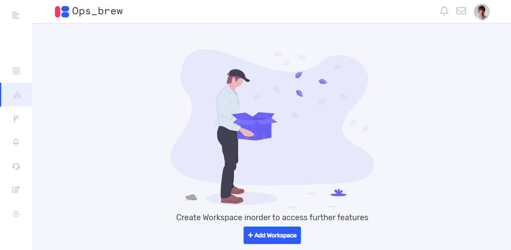
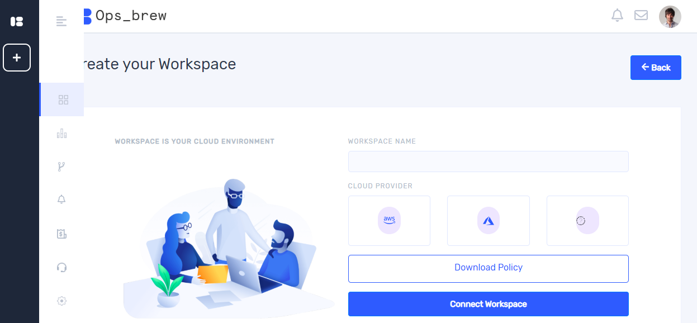
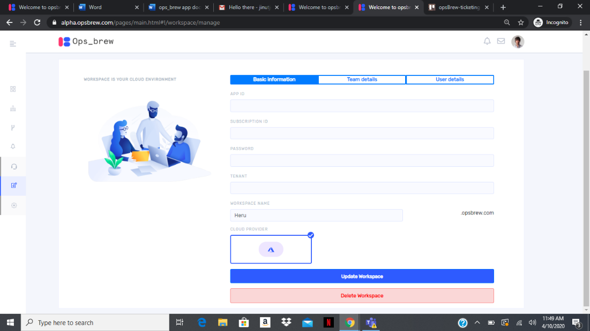
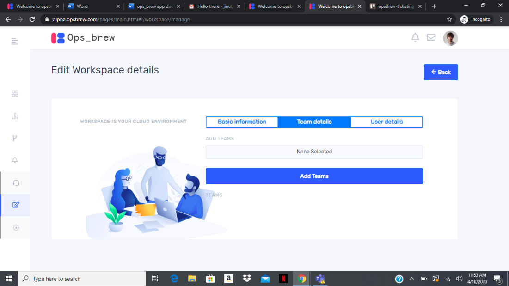
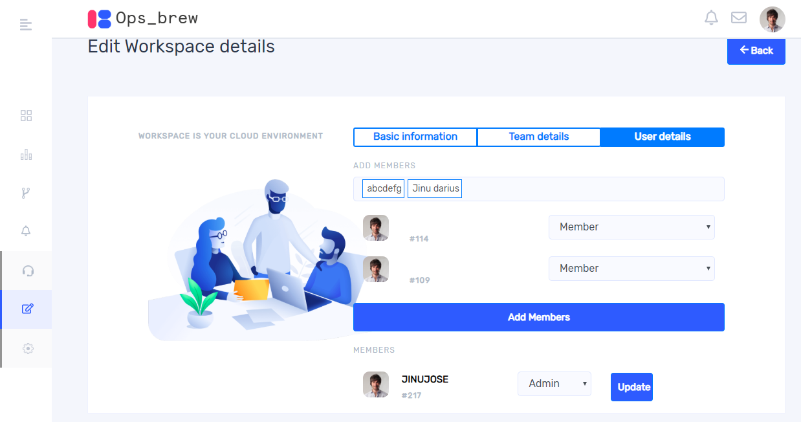

## Workspace

Workspace is basically a cloud environment and needs to be created in order to access further features. Once you successfully sign into Ops_brew account you will get a window as shown below.  

On clicking ‘+ Add workspace’ you will get create your workspace window. You can create workspace in both AWS and Azure.

Give the workspace name and select one cloud provider and click connect workspace. If you want to create multiple workspace under one organization, you can add workspace by clicking workspace icon from left side bar. Once you click workspace icon, a pop up will appear on left side and on clicking ‘ +’ button you can create workspace.  
> **3.1 :  Aws workspace**  
>If you select AWS, you must give access key and secret key.

>**3.2 : Azure workspace**  
>If you select Azure, you must give app id, Subscription id, password and tenant.

You can update and delete workspace by clicking manage your workspace icon from left side bar.  Complete all fields in the window to update or delete the workspace. You can see the team and user details in other tabs. Once you click team details, it takes you to the following window

You can add teams to your workspace by selecting teams and clicking “ Add teams”.
On clicking user details, you get a window as shown below. You can add users here by selecting members and  clicking ‘Add members’. You can  update the role of a user and also can remove a user from workspace. 

## Create User
