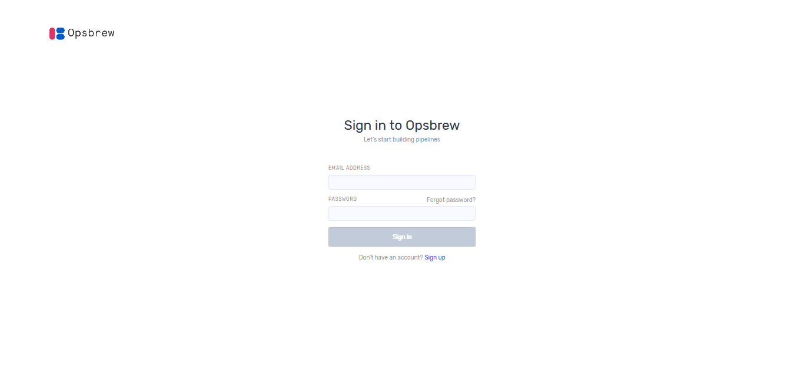

# Getting started  
 
This provides information to get you up and running with Opsbrew pipelines. It gives you the flexibility to easily create pipelines. Opsbrew is a logging-as-a-service solution. All it takes is one click and Opsbrew’s ingestion engine pre-processes logs from multiple distributed sources and routes them to multiple distributed destinations.

We show how to use Opsbrew  and how to create organization, landscape, environment, pipeline, alerts etc. If you are visiting our platform for the first time, a sign-up page will appear to create your Opsbrew account. 

## Ops_brew Account Creation 

Users who do not have an Ops_brew application account can select `sign up` to get access.  

Enter username and valid email address then select country and give valid phone number. Set a password and confirm it then click ‘sign up’. 

For activating the account, you must verify your email. After email verification, you can sign in.  

 