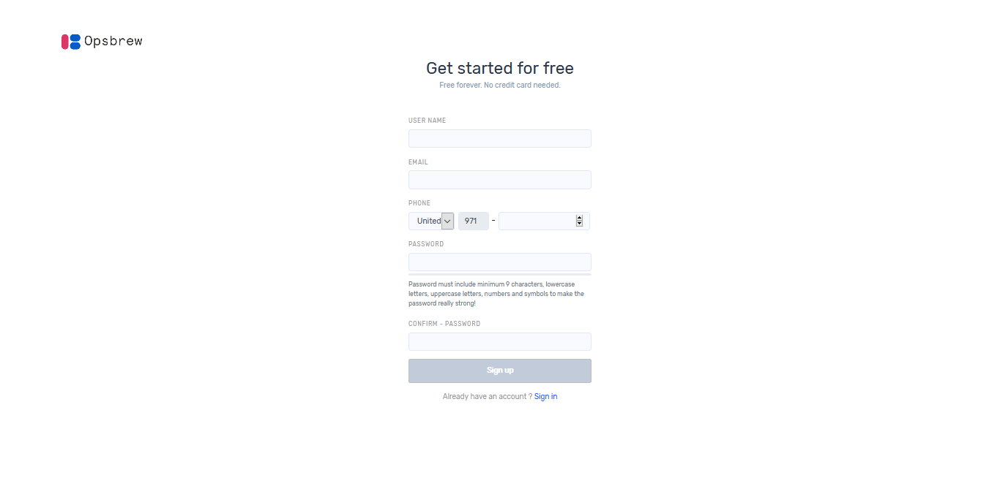

# Opsbrew Account Creation 

Users who do not have an Opsbrew application account can select `sign up` to get access.  

Enter username and valid email address then select country and give valid phone number. Set a password and confirm it then click ‘sign up’. 

For activating the account, you must verify your email. After email verification, you can sign in.  

 