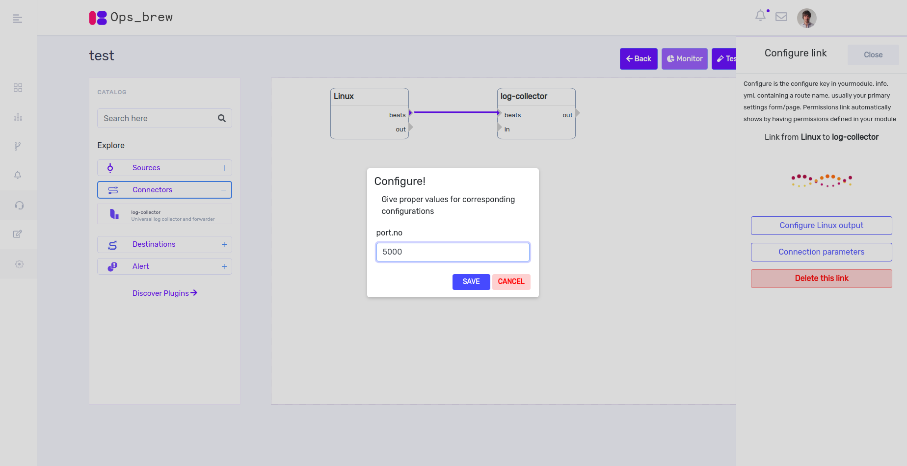
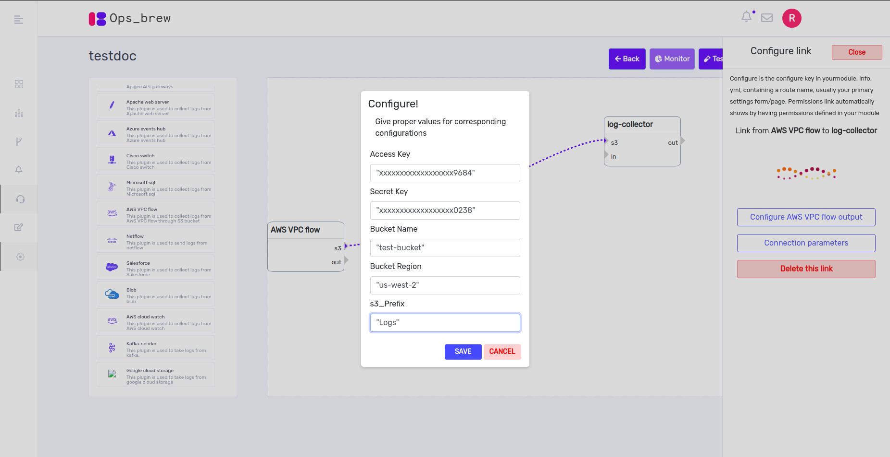
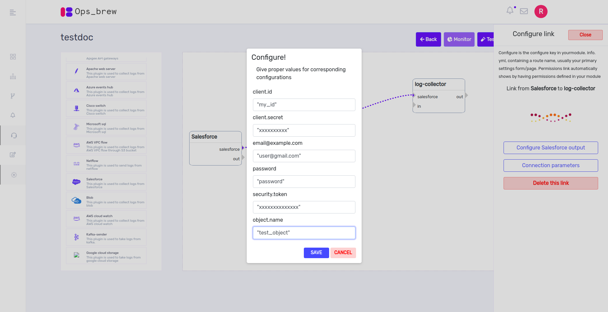

# Sources 

Log collector can pull or receive from below listed log sources using source plugins. Source plugins are place holders for actual sources and tells log collector, how logs will be flowing through. Lets quickly go through all supportred sources and how to configure them.  
 
In general, there can be multiple methods for sending logs from one point to another. We call it as method across the documentation. 

## 1) Linux 

We have 2 supported methods to configure Linux sources. 

`Syslog` 

`Beats` 

### Syslog 

This input will send log messages to log collector in syslog format. This plugin combines a TCP/UDP listener on port 514 and listens for RCF3164-compliant events. Log collector can read syslog messages using the syslog source plugin and forward them to any number of output destinations. 

Configuration parameters: 

`port.no:`  

The port log collector should listen on. 

`codec.format:`

The codec used for input data. Input codecs are a convenient method for decoding your data before it enters the input, without needing a separate filter in your Log collector pipeline. Commonly used formats are ‘plain’ , ‘json’, ‘json_lines’ and ‘cef’. 

### Beats 

The Elastic Beats family which are light data collectors include several shippers for all kinds of data (logs, metrics, events, etc.). The different beats, such as Filebeat and Metricbeat, act as lightweight shippers that collect different types of data and subsequently ship it into log collector for more advanced processing. 

Using Beats components in log collector is very simple. Beats events are listened on port “5044” by default and you can change that by editing the port number. 

Configuration parameters: 

`port.no:`  

The port log collector should listen on. 

## 2) Windows 

Currently windows only supports beats method. 

### Beats

Configuration parameters: 

`port.no:` 

The port that the log collector should listen on. 

 

## 3) CISCO CMX 

Cisco CMX can be configured to send logs in syslog method. 

Syslog 

Configuration parameters: 

`port.no:`  

The port log collector should listen on. 

`codec.format:` 

The codec used for input data.  

`

 ## 4) Aruba ALE 

Aruba ALE can be configured to send logs in syslog method.

### Syslog 

This input will send log messages to log collector. This plugin combines a TCP/UDP listener on port 514 and listens for RCF3164-compliant events. Log collector can read syslog messages using the syslog source plugin and forward them to any number of output destinations. 

Configuration parameters: 

`port.no:`  

The port log collector should listen on. 

`codec.format:` 

The codec used for input data.  

## 5) Switches 

Network switches can be configured to send logs syslog method. 

### Syslog 

This input will send log messages to log collector. This plugin combines a TCP/UDP listener on port 514 and listens for RCF3164-compliant events. Log collector can read syslog messages using the syslog source plugin and forward them to any number of output destinations. 

Configuration parameters: 

`port.no:`  

The port log collector should listen on. 

`codec.format:` 

The codec used for input data.  

## 6) Routers 

Network routers can be configured to send logs syslog method. 

### Syslog 

This input will send log messages to log collector. This plugin combines a TCP/UDP listener on port 514 and listens for RCF3164-compliant events. Log collector can read syslog messages using the syslog source plugin and forward them to any number of output destinations. 

Configuration parameters: 

`port.no:`  

The port log collector should listen on. 

`codec.format:` 

The codec used for input data.  

## 7) S3 bucket 

S3 source plugin integrates with the Amazon S3 object storage built to store and retrieve data from websites and mobile apps, corporate software, and data from IoT sensors and devices. 

The S3 source plugin can stream events from files in S3 buckets. Each line from each file in S3 bucket will generate an event and the log collector will capture it. To use this plugin, you'll need a S3 bucket configured and AWS credentials to access that bucket.  

Supported method is s3. 

Configuration parameters: 

`bucket:`

Name of your s3 bucket. 

`region:` 

The region used while creating your s3 bucket.  

`access_key_id:` 

Your AWS access key. 

`secret_access_key:` 

Your AWS secret key. 

`prefix:`

If specified, the prefix of filenames in the bucket must match (not a regexp). 

## 8) Blob 

The blob source plugin can stream events from containers in your blob. 

Configuration parameters: 

`storage_account_name:`  

The name of your storage account 

`storage_access_key:` 

Your access key id. 

`container:` 

The name of your container. 

## 9) Google cloud storage 

This plugin can be used to pull logs from GCS. 

Supported method is gcs. 

Configuration parameters: 

`bucket:`                                    

The name of your bucket. 

`json_key_file:` 

Your json key. 

`log_file_prefix:`

The prefix of your log file. 

## 10) AWS cloud watch 

Amazon CloudWatch is an AWS cloud monitoring service that allows monitoring AWS applications and instances to get actionable insights about your cloud deployments. The platform collects various types of operational data such as logs, metrics, and events. You can directly connect to the stream of events from AWS CloudWatch using the CloudWatch source plugin. Various filters can be configured to define what metrics to fetch from CloudWatch. 

Configuration parameters: 

`namespace:`  

The namespace used. 

`region:` 

The name of the region used. 

`filters:{ "logStream:Group" => "" }` 

The name of the group you want to filter. For example: 

`filters => { "tag:Group" => "Production" }` 

## 11) AWS cloudtrail 

The AWS cloud trail logs can be configured such that they are sent to an S3 bucket. Then, AWS cloudtrail source plugin can be configured to recieve logs. Supported method is S3 

Configuration parameters: 

`bucket:`  

Name of your s3 bucket. 

`region:` 

The region used while creating your s3 bucket.  

`access_key_id:` 

Your AWS access key. 

`secret_access_key:` 

Your AWS secret key. 

## 12) AWS VPC flow 

The AWS VPC flow logs can be configured such that they are sent to an S3 bucket. Then, the AWS VPC flow source plugin can be used to collect the logs. Supported method is S3. 

Configuration parameters: 

`bucket:`  

Name of your s3 bucket. 

`region:` 

The region used while creating your s3 bucket.  

`access_key_id:` 

Your AWS access key. 

`secret_access_key:` 

Your AWS secret key. 

## 13) Azure network flow 

The Azure network flow logs can be configured such that they are sent to a blob storage account. Then, the blob source plugin can be used to collect the logs. 

Configuration parameters: 

`storage_account_name:`  

The name of your storage account 

`storage_access_key:` 

Your access key id. 

`container:` 

The name of your container. 

## 14) Azure activity log 

Azure tracks all the events in your Azure Account/Subscription and publishes it to Azure Activity Log service. Azure activity log can be configured such that they are stored in `azure events hub`. Then, the azure events hub source plugin can be used to fetch the logs. 

Configuration parameters: 

`event_hub_connections:` 

The connections used. 

`consumer_group:` 

The consumer group name. 

`storage_connection:` 

The storage connection used. 

## 15) Kafka 

Apache Kafka is a streaming platform that combines a messaging queue and publish/subscribe functionality.  The Log collector Kafka plugin easily integrates with Kafka Producer and Consumer APIs. You can specify multiple topics to subscribe to while using the default offset management strategy. A great feature of the plugin is that you can run multiple log collector instances reading the same topic in order to distribute the load across multiple physical machines. To use this feature, you need to specify a ‘group_id’ which creates a single logical subscriber made of multiple processors. Messages in a topic will be distributed to all log collector instances with the same ‘group_id’. 

Configuration parameters: 

`bootstrap_servers:` 

The server and port used. For example, "localhost:9092" 

`topics:` 

The name of the topic. 

`group_id:` 

The group id used. 

## 16) Salesforce

The Salesforce source plugin can be used to integrate with Salesforce which is a popular PaaS for CRM, task management, and marketing.  

Configuration parameters: 

`client_id:`  

Oauth client id from your sdfc app. 

`client_secret:`  

Oauth client secret from your sdfc app. 

`username:`

Your username or email. 

`password:`  

Your password. 

`security_token:` 

The security token for your Salesforce instance. 

`sfdc_object_name:`  

The object name for the data from your sdfc app. 

## 17) Apigee 

Apigee supports logs to be send as syslog messages to a syslog server.  

Apigee log source can be configured with method syslog to send logs to log collector 

Configuration parameters: 

`port.no:` 

The port that the log collector should listen on. 

 

## 18) Microsoft SQL 

The jdbc source plugin can be used to fetch the logs from Microsoft SQL. 

Configuration parameters: 

`jdbc_driver_library:` 

The path to library. For example: (/root/sqljdbc_4.2/enu/jre8/sqljdbc42.jar) 

`jdbc_driver_class:`  

Driver.class. For example: (com.microsoft.sqlserver.jdbc.SQLServerDriver) 

`jdbc_connection_string: ` 

Connection.string. For example: (jdbc:sqlserver://server1:1433;databaseName=db1;integratedSecurity=false;) 

`jdbc_user: `

User name. 

`jdbc_password: `

Password. 

 

## 19) Forcepoint 

Forcepoint logs can be fetched using the tcp source plugin with the codec cef and type as syslog. 

Configuration parameters: 

`port.no:`  

The port that the log collector should listen on. 

## 20) Kaspersky 

### Syslog 

This input will send machine messages to log collector. This plugin combines a TCP/UDP listener on port 514 and listens for RCF3164-compliant events. Log collector can read syslog messages using the syslog source plugin and forward them to any number of output destinations. 

Configuration parameters: 

`port.no:  `

The port log collector should listen on. 

`codec.format: `

The codec used for input data. Input codecs are a convenient method for decoding your data before it enters the input, without  needing a separate filter in your Log collector pipeline. Commonly used formats are ‘Plain’ , ‘json’ and ‘cef’. 

 

## 21) Nexpose 

### Beats 

The Elastic Beats family which are light data collectors include a number of shippers for all kinds of data (logs, metrics, events, etc.). The different beats, such as Filebeat and Metricbeat, act as lightweight shippers that collect different types of data and subsequently ship it into log collector for more advanced processing. 

Using Beats components in log collector is very simple. Beats events are listened on port “5044” by default and you can change that by editing the port number. 

Configuration parameters: 

`port.no:  `

The port that the log collector should listen on. 

## 22) EMC & HP 

### Syslog 

This input will send machine messages to log collector. This plugin combines a TCP/UDP listener on port 514 and listens for RCF3164-compliant events. Log collector can read syslog messages using the syslog source plugin and forward them to any number of output destinations. 

Configuration parameters: 

`port.no:`  

The port log collector should listen on. 

`codec.format:` 

The codec used for input data. Input codecs are a convenient method for decoding your data before it enters the input, without  needing a separate filter in your Log collector pipeline. Commonly used formats are ‘Plain’ , ‘json’ and ‘cef’. 

## 23) Vmware 
 
Vmware logs can be fetched using the udp source plugin with type as syslog. 

Configuration parameters: 

`port.no:`  

The port that the log collector should listen on. 

## 24) Jboss web server 

### Beats 

The Elastic Beats family  which are light data collectors include a number of shippers for all kinds of data (logs, metrics, events, etc.). The different beats, such as Filebeat and Metricbeat, act as lightweight shippers that collect different types of data and subsequently ship it into log collector for more advanced processing. 

Using Beats components in log collector is very simple. Beats events are listened on port “5044” by default and you can change that by editing the port number. 

Configuration parameters: 

`port.no:`  

The port that the log collector should listen on. 

## 25) Apache webserver 

### Beats 

The Elastic Beats family  which are light data collectors include a number of shippers for all kinds of data (logs, metrics, events, etc.). The different beats, such as Filebeat and Metricbeat, act as lightweight shippers that collect different types of data and subsequently ship it into log collector for more advanced processing. 

Using Beats components in log collector is very simple. Beats events are listened on port “5044” by default and you can change that by editing the port number. 

Configuration parameters: 

`port.no:`  

The port that the log collector should listen on. 

## 26) IIS 

### Beats 

The Elastic Beats family  which are light data collectors include a number of shippers for all kinds of data (logs, metrics, events, etc.). The different beats, such as Filebeat and Metricbeat, act as lightweight shippers that collect different types of data and subsequently ship it into log collector for more advanced processing. 

Using Beats components in log collector is very simple. Beats events are listened on port “5044” by default and you can change that by editing the port number. 

Configuration parameters: 

`port.no:`  

The port that the log collector should listen on. 

## 27) Fortinet Firewall 

Fortinet Firewall logs can be fetched with the tcp source plugin using the codec cef and type as syslog. 

Configuration parameters: 

`port.no:`  

The port that the log collector should listen on. 

## 28) Cisco Router 

Cisco Router logs can be fetched using the udp source plugin with type as syslog-cisco. 

Configuration parameters: 

`port.no:`  

The port that the log collector should listen on. 

## 29) Cisco WC 

Cisco WC logs can be fetched with the tcp source plugin using the codec cef and type as syslog. 

Configuration parameters: 

`port.no:`  

The port that the log collector should listen on. 

## 30) Cisco Switch 

Cisco Switch logs can be fetched using the udp source plugin with type as syslog-cisco. 

Configuration parameters: 

`port.no:`  

The port that the log collector should listen on. 

## 31) A10 network device 

### Beats 

The Elastic Beats family  which are light data collectors include a number of shippers for all kinds of data (logs, metrics, events, etc.). The different beats, such as Filebeat and Metricbeat, act as lightweight shippers that collect different types of data and subsequently ship it into log collector for more advanced processing. 

Using Beats components in log collector is very simple. Beats events are listened on port “5044” by default and you can change that by editing the port number. 

Configuration parameters: 

`port.no:`  

The port that the log collector should listen on. 

