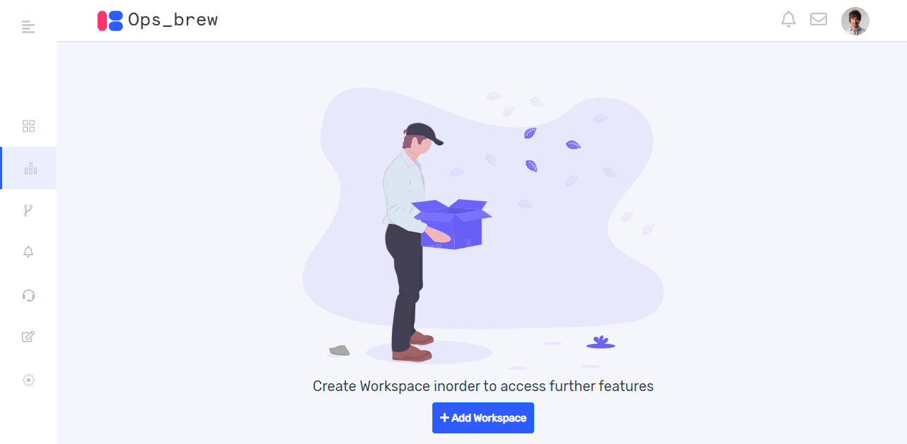
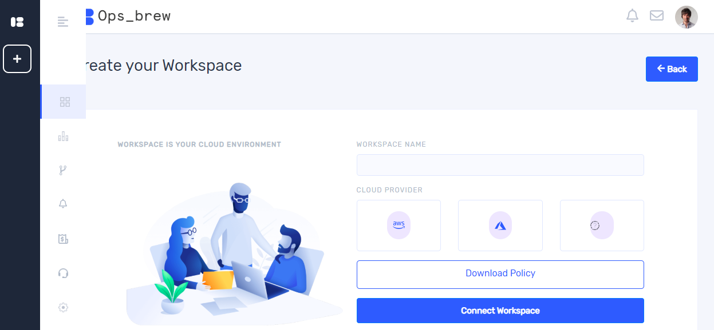
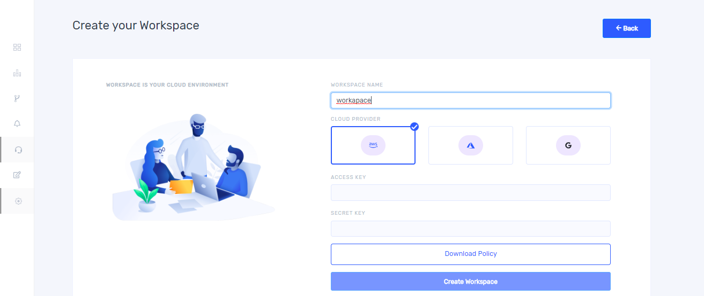
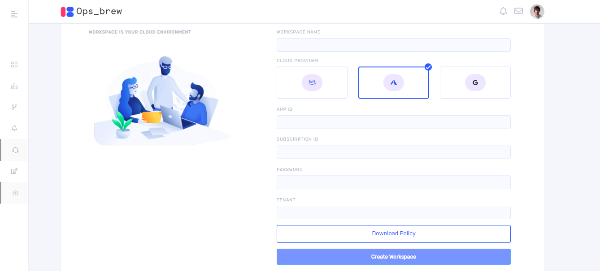
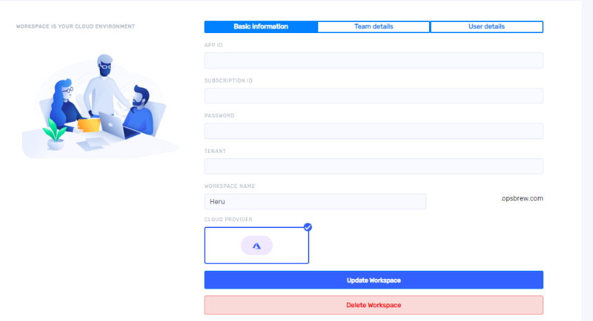
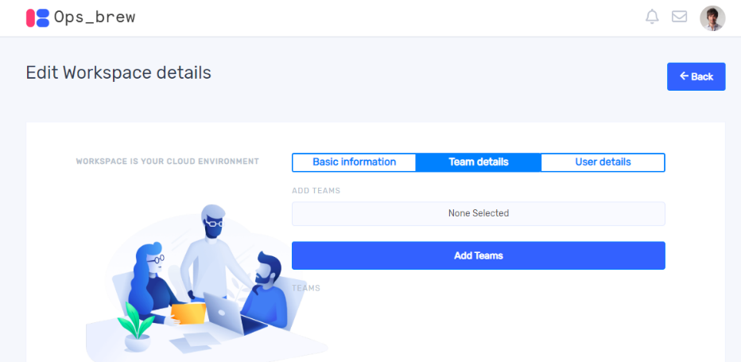
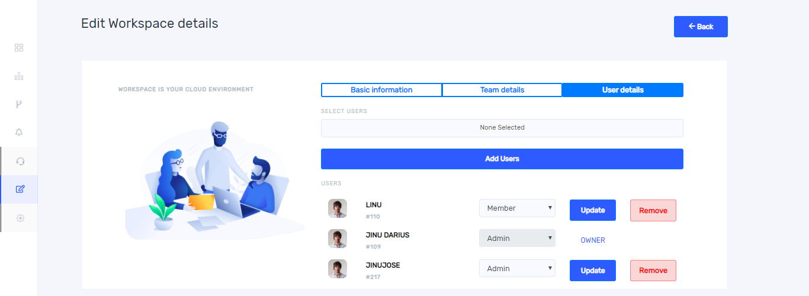

Workspace is basically a cloud environment and needs to be created in order to access further features. 

## Create workspace

Once you successfully sign into Ops_brew account you will get a window as shown below.  

On clicking `+ Add workspace` you will get create your workspace window. You can create workspace in both AWS and Azure.

Give the workspace name and select one cloud provider and click `Connect Workspace`. If you want to create multiple workspace under one organization, you can add workspace by clicking workspace icon from left side bar. Once you click workspace icon, a pop up will appear on left side and on clicking `+` button you can create workspace.  

### Aws workspace

Once you select AWS as a cloud provider, it takes you to the fields as shown below. Access key and secret key should be given in the appropriate fields. 

### Azure workspace

If you select Azure, you must give app id, Subscription id, password and tenant in the appropriate fields as shown below.

After completing all the fields click `Create workspace`.

## Manage Workspace 

You can update and delete workspace by clicking `Manage` icon from left side bar in the main window. Once you click `Manage` it takes you to the following window. For deleting click `Delete workspace` button. 

You cannot switch between cloud providers while updating a workspace. Complete all the fields in the window to update the workspace. You can see the team and user details in other tabs. Once you click on `Team details`, it will take you to the following window. 

You can add teams to your workspace by selecting teams and clicking `Add teams`.

On clicking `User details`, you get a window as shown below. You can add users here by selecting users and  clicking `Add user`. You can update the role of a user and also can remove a user from the workspace.  

