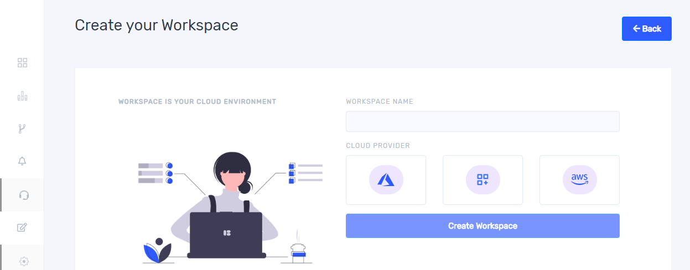
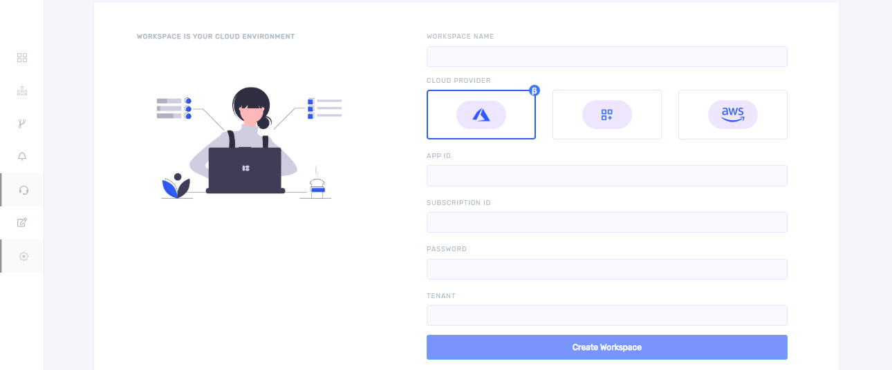
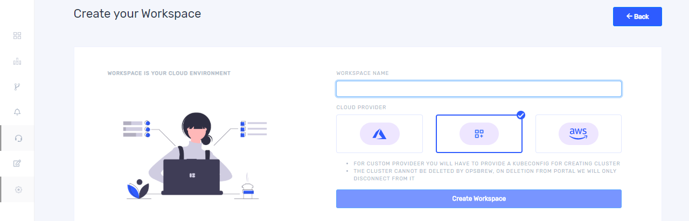
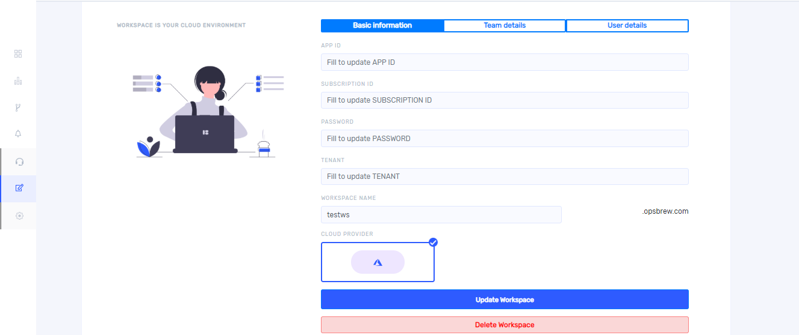

Workspace is an isolated space specific to a cloud provider or a custom provider and needs to be created after organization creation in order to access further features. Each workspace you create will be connected to a specific cloud environment.

## Create workspace

Once you successfully created organization, you will get a window as shown below.

On clicking `+ Add workspace` you will get 'create your workspace' window. Give an appropriate name in the `workspace name` field. You can create workspace in both Azure and AWS and a custom workspace is also provided. 

Give the workspace name and select one cloud provider and click `Create Workspace`.

## Azure workspace

If you select Azure, you must give app id, subscription id, password and tenant id in appropriate fields as shown below.

After completing all the fields click `Create workspace`.

## Custom workspace 

If you select the second custom provider, you will get the following window. 

Give workspace name and click `Create Workspace`. If you select custom provider, you will have to provide a kubeconfig file during cluster creation. 

## Aws workspace

Once you select AWS as the cloud provider, it takes you to the fields as shown below. Access key and secret key should be given in the appropriate fields. 

If you want to create multiple workspaces under one organization, you can add workspace by clicking workspace icon from left side bar. Once you click workspace icon, a pop up will appear on left side as shown below. 

On clicking `+` button you can create more workspace.   

## Manage Workspace 

You can update and delete workspace by clicking `Manage` icon from left side bar in the main window. Once you click `Manage` it takes you to the following window. For deleting click `Delete workspace` button. 

You cannot switch between cloud providers while updating a workspace. Complete all the fields in the window to update the workspace. You can see the team and user details in other tabs. Once you click on `Team details`, it will take you to the following window. 

You can add teams to your workspace by selecting teams and clicking `Add teams`. Role of the team can be changed by the owner of the workspace and users who have admin and collaborator role in the workspace. Admin has the privilege to remove team from workspace. 

On clicking `User details`, you get a window as shown below. You can add users here by selecting users and  clicking `Add user`. You can update the role of a user and also can remove a user from the workspace.  

